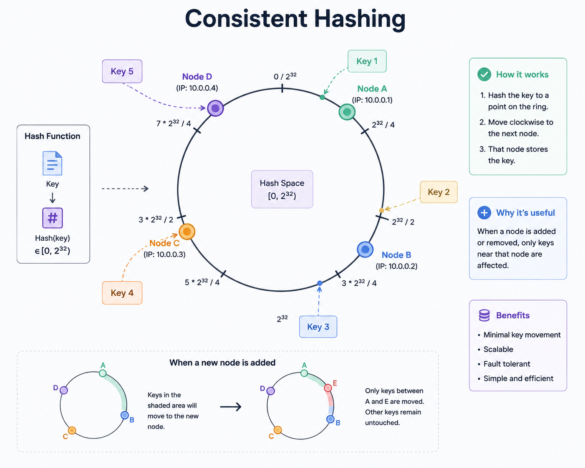

# 50 System Design Patterns Every Engineer Should Know in 90 Minutes [2026 Edition]

- **Source:** https://designgurus.substack.com/p/50-system-design-patterns-every-engineer
- **Author:** Arslan Ahmad (System Design Nuggets)
- **Published:** May 11, 2026
- **Fetched:** May 14, 2026

---

**What This Guide Covers**

- 50 system design patterns organized into 10 categories
- Each pattern explained in 2-3 sentences: what it does, when to use it, and the trade-off
- Real-world examples for every pattern
- A cheat sheet you can review in 90 minutes before any system design interview

---

There are not 500 system design concepts.

There are roughly 50 patterns that recombine in different ways to solve every problem you will encounter in an interview or in production.

The engineer who knows these 50 patterns can design any system.

The engineer who has memorized the architectures of Twitter, Uber, and Netflix but does not know the underlying patterns will freeze the moment the interviewer asks a variation on them.

This guide gives you all 50.

Each pattern is explained concisely: what it does, when you reach for it, and what you trade away by using it.

The patterns are organized into 10 categories.

Read through the entire guide once (about 90 minutes), and you will have a working vocabulary for any system design conversation. Return to specific patterns when you need a refresher before an interview.

---

## Category 1: Data Storage Patterns

### 1. Primary-Replica (Leader-Follower)

One database server (the primary) handles all writes.

One or more replicas receive copies of the writes and handle reads.

If the primary fails, a replica is promoted to become the new primary.

**When to use:** Any system where reads vastly outnumber writes (social media feeds, product catalogs, user profiles). You scale reads horizontally by adding more replicas.

**Trade-off:** Replicas may be slightly behind the primary (replication lag), so reads from replicas may return stale data. Use synchronous replication for zero lag (slower writes) or asynchronous replication for fast writes (risk of stale reads).

### 2. Sharding (Horizontal Partitioning)

Split your data across multiple database servers. Each server (shard) holds a portion of the data.

A shard key determines which shard holds which data.

**When to use:** When a single database cannot handle the write throughput or storage volume. A user table with 1 billion rows that receives 100,000 writes per second needs sharding.

**Trade-off:** Cross-shard queries are expensive (queries that need data from multiple shards require scatter-gather).

Choosing the wrong shard key creates hot spots. Resharding (changing the shard key) is painful and often requires downtime.

### 3. Consistent Hashing

A hashing scheme where adding or removing a server only requires remapping a small fraction of keys, rather than reshuffling everything.

Servers and keys are placed on a virtual ring. Each key maps to the nearest server clockwise on the ring.

**When to use:** Distributed caches (Redis Cluster), distributed databases (DynamoDB, Cassandra), CDN request routing. Any system where nodes are added or removed frequently and you want to minimize data movement.

**Trade-off:** More complex than simple modular hashing. Can produce uneven distribution without virtual nodes (each physical server maps to multiple positions on the ring).

### 4. Write-Ahead Log (WAL)

Before writing data to the main storage, write the operation to a sequential log file.

If the system crashes, replay the log on restart to recover incomplete operations.

**When to use:** Every reliable database uses WAL internally (PostgreSQL, MySQL, Cassandra). Also used for database replication (replicas replay the primary's WAL) and change data capture (applications read the WAL to react to data changes).

**Trade-off:** Double-write overhead (write to log, then write to storage). The log grows continuously and needs periodic compaction.

### 5. Event Sourcing

Instead of storing the current state of an entity, store a sequence of events that happened to it.

The current state is derived by replaying all events.

"OrderCreated → ItemAdded → ItemAdded → PaymentReceived → OrderShipped" reconstructs the order's current state.

**When to use:** Systems where audit history is critical (financial systems, compliance-heavy domains). Systems where you need to reconstruct past states. Systems where multiple views of the same data are needed (each view derives its state from the event stream).

**Trade-off:** Querying the current state requires replaying events (solved with snapshots). Event schema evolution is complex (old events must remain readable as the schema changes). Storage grows indefinitely.

### 6. CQRS (Command Query Responsibility Segregation)

Separate the write model (commands: create, update, delete) from the read model (queries: search, list, aggregate).

The write model is optimized for consistency and validation.

The read model is optimized for fast queries and may use a different database or schema.

**When to use:** Systems with very different read and write patterns. An e-commerce system might write orders to a normalized relational database but serve the product catalog from a denormalized search index (Elasticsearch).

**Trade-off:** Increased complexity (two models to maintain, a synchronization mechanism between them). Eventual consistency between the write and read models.

---

## Category 2: Caching Patterns

### 7. Cache-Aside (Lazy Loading)

The application checks the cache first.

On a cache hit, return the cached data.

On a cache miss, read from the database, return the data, and populate the cache for next time.

**When to use:** The default caching strategy for most applications. Works well when reads are far more frequent than writes and cache misses are tolerable.

**Trade-off:** The first request for any piece of data is always slow (cache miss). Cache and database can be inconsistent if the database is updated without invalidating the cache.

### 8. Write-Through

Every write goes to both the cache and the database simultaneously. The cache is always up to date.

**When to use:** Systems where read-after-write consistency is critical. A user updates their profile and immediately sees the updated version.

**Trade-off:** Every write is slower (two writes instead of one). Writing data to the cache that is never read wastes cache space.

### 9. Write-Behind (Write-Back)

Writes go to the cache first. The cache asynchronously flushes writes to the database in batches.

The application sees fast writes because it only waits for the cache write.

**When to use:** Write-heavy systems where brief inconsistency is tolerable. Gaming leaderboards, analytics counters, session stores.

**Trade-off:** Risk of data loss if the cache crashes before flushing to the database. Harder to debug because the database lags behind the cache.

### 10. Read-Through

The cache itself is responsible for loading data from the database on a miss. The application only talks to the cache, never directly to the database.

**When to use:** When you want to simplify the application layer. The caching logic lives in the cache infrastructure rather than in application code.

**Trade-off:** The cache must know how to query the database, which couples the cache to the data layer. Less flexible than cache-aside.

### 11. Cache Stampede Prevention

When a popular cache entry expires, thousands of simultaneous requests hit the database for the same data. This is a cache stampede (or thundering herd).

**When to use:** Any system with popular cached entries that expire. Celebrity profiles on social media, trending product pages, frequently accessed configurations.

**Trade-off:** Solutions include request coalescing (only one request goes to the database, others wait), probabilistic early expiration (randomly refresh entries before they expire), and lock-based loading (the first request acquires a lock, others wait). Each adds complexity.

---

## Category 3: Communication Patterns

### 12. Request-Response (Synchronous)

The client sends a request and waits for a response. The simplest communication pattern. REST and gRPC follow this model.

**When to use:** Any interaction where the client needs an immediate answer. User-facing APIs, database queries, authentication checks.

**Trade-off:** The client is blocked while waiting. If the server is slow, the client is slow. Chains of synchronous calls create cascading failure risk.

### 13. Message Queue (Asynchronous)

The producer puts a message on a queue.

The consumer reads and processes the message at its own pace.

The producer does not wait for the consumer.

**When to use:** Decoupling services that do not need immediate results. Sending emails after user signup, processing image uploads, and generating reports.

**Trade-off:** The result is not immediate. Adds a new infrastructure component (the queue) that must be managed. Message ordering and exactly-once delivery add complexity.

### 14. Publish-Subscribe (Pub/Sub)

A publisher broadcasts messages to a topic.

Multiple subscribers listen to the topic, and each receives a copy of every message.

Unlike a queue (where each message goes to one consumer), pub/sub delivers to all subscribers.

**When to use:** Event-driven architectures where multiple services need to react to the same event. "OrderCreated" triggers the inventory service, the notification service, and the analytics service simultaneously.

**Trade-off:** Subscribers must handle messages idempotently (they might receive duplicates). Message ordering across subscribers is not guaranteed.

### 15. Event-Driven Architecture

Services communicate by emitting and reacting to events rather than making direct calls.

The order service emits "OrderPlaced."

The inventory service reacts by reserving stock.

The payment service reacts by initiating a charge.

**When to use:** Systems with loosely coupled services that need to evolve independently. Microservices architectures where teams own individual services.

**Trade-off:** Debugging is harder (the workflow is distributed across multiple services and event logs). End-to-end latency is unpredictable (depends on queue depth and consumer processing time).

### 16. Webhooks

Instead of the client polling for updates, the server pushes events to a client-provided URL. "When this order ships, POST the tracking info to this URL."

**When to use:** Third-party integrations (Stripe sends payment webhooks, GitHub sends push webhooks). Any system where the server knows when something happens and the client needs to be notified.

**Trade-off:** The client must expose a publicly accessible URL. Delivery is not guaranteed (the client might be down). Requires retry logic and idempotency handling.

### 17. Server-Sent Events (SSE)

A one-directional push from server to client over a long-lived HTTP connection. The server sends events as they occur. The client receives them without polling.

**When to use:** Live dashboards, notification feeds, stock price tickers. Any case where the server pushes updates but the client does not need to send messages back.

**Trade-off:** Unidirectional (server to client only). Connection limits per browser. Less flexible than WebSockets but simpler to implement.

### 18. Bidirectional Streaming (WebSockets / gRPC Streaming)

A persistent connection where both client and server can send messages at any time. WebSockets over HTTP, or bidirectional streaming in gRPC.

**When to use:** Real-time chat, multiplayer games, collaborative editing, live video streaming controls.

**Trade-off:** Maintaining millions of persistent connections requires specialized infrastructure (connection routing, health checking, graceful reconnection). More complex than request-response.

---

## Category 4: Reliability Patterns

### 19. Circuit Breaker

When a downstream service fails repeatedly, stop calling it. Return a fallback response immediately. Periodically test whether the service has recovered.

**When to use:** Any service that depends on another service. Prevents a failing dependency from taking down the caller.

**Trade-off:** The fallback response may be degraded (cached data instead of fresh data, a generic recommendation instead of personalized). Requires tuning the failure threshold and recovery timeout.

### 20. Retry with Exponential Backoff

When a request fails, retry after increasing delays: 1 second, 2 seconds, 4 seconds, 8 seconds. Add jitter (random delay) to prevent thundering herds.

**When to use:** Any transient failure (network timeout, temporary server overload). Most cloud SDK clients implement this automatically.

**Trade-off:** Retries can amplify load on an already struggling service. Must set a maximum retry count to prevent infinite loops.

### 21. Bulkhead

Isolate different workloads into separate resource pools. If one workload exhausts its pool, other workloads are unaffected. Named after the watertight compartments in a ship's hull.

**When to use:** Multi-tenant systems (isolate tenants so one cannot affect others). Systems with mixed workloads (isolate batch processing from real-time serving).

**Trade-off:** Less efficient resource utilization (each pool has reserved capacity that sits idle during low traffic).

### 22. Timeout

Set a maximum duration for every external call. If the call does not complete within the timeout, abort and return an error or fallback.

**When to use:** Every external call in a distributed system. Without timeouts, a slow dependency causes the caller to wait indefinitely, consuming resources.

**Trade-off:** Setting the timeout too low causes false failures on healthy but slow responses. Setting it too high delays failure detection.

### 23. Idempotency

Design operations so that executing them multiple times produces the same result as executing them once.

The client retries a payment request.

The server recognizes the duplicate and returns the original result without charging twice.

**When to use:** Every write API in a distributed system. Network failures make it impossible for the client to know whether the server processed the request.

**Trade-off:** Requires storing idempotency keys and checking for duplicates on every request. Adds a database lookup to the write path.

### 24. Dead Letter Queue (DLQ)

When a message cannot be processed after multiple retries, move it to a separate queue (the dead letter queue) instead of blocking the main queue. Engineers investigate and fix the failed messages manually or automatically.

**When to use:** Any message-driven system. Without a DLQ, a single poisonous message can block processing of all subsequent messages.

**Trade-off:** Messages in the DLQ need monitoring and manual intervention. If ignored, the DLQ grows indefinitely.

### 25. Graceful Degradation

When a non-critical component fails, continue serving a degraded but functional experience instead of failing entirely.

- The recommendation service is down? Show trending items instead of personalized recommendations.
- The image service is slow? Show text-only content with image placeholders.

**When to use:** Any user-facing system with multiple subsystems of varying criticality.

**Trade-off:** Requires identifying which features are critical (must work) vs non-critical (can degrade). Requires designing and testing the degraded experience.

---

## Category 5: Scaling Patterns

### 26. Horizontal Scaling

Add more machines to handle more traffic. 10 servers handle 10x the traffic of 1 server.

**When to use:** Stateless services (any request can be handled by any server). Web servers, API servers, workers.

**Trade-off:** Requires a load balancer. Requires stateless design (session data must live outside the server, in Redis or a database). Does not help if the bottleneck is a single database.

### 27. Vertical Scaling

Upgrade to a more powerful machine. More CPU, more RAM, faster disks.

**When to use:** Databases (scaling a database horizontally via sharding is complex, but upgrading the hardware is simple). Single-threaded workloads. Quick fix before implementing horizontal scaling.

**Trade-off:** Finite ceiling (the biggest machine available). Single point of failure. Expensive at the top end.

### 28. Load Balancing

Distribute incoming requests across multiple servers.

Algorithms include round-robin, least connections, weighted, and IP hash.

**When to use:** Every horizontally scaled system. The first component you add when a single server cannot handle the traffic.

**Trade-off:** Adds latency (one more network hop). The load balancer itself can become a bottleneck or single point of failure (solved with redundant load balancers).

### 29. Auto-Scaling

Automatically add or remove server instances based on traffic. When CPU exceeds 70%, add instances. When traffic drops, remove instances.

**When to use:** Cloud-deployed systems with variable traffic patterns. E-commerce sites during flash sales, streaming platforms during live events.

**Trade-off:** Scaling up takes time (minutes to provision new instances).

Requires careful metric selection (CPU? Request count? Queue depth?).

Over-aggressive scaling wastes money. Under-aggressive scaling causes outages.

### 30. Database Connection Pooling

Instead of opening a new database connection for every request (expensive: ~50ms per connection), maintain a pool of reusable connections.

Requests borrow a connection, use it, and return it to the pool.

**When to use:** Every application that talks to a database. Without pooling, the database runs out of connections under load.

**Trade-off:** Pool size must be tuned. Too small: requests wait for a connection. Too large: the database is overwhelmed with connections.

---

## Category 6: Data Processing Patterns

### 31. MapReduce

Split a large dataset across many machines (map phase). Each machine processes its portion independently. Combine the results (reduce phase).

The foundation of batch data processing.

**When to use:** Processing terabytes of data that does not need real-time results. Daily analytics, data warehouse ETL, log aggregation.

**Trade-off:** High latency (minutes to hours). Not suitable for real-time processing.

### 32. Stream Processing

Process data as it arrives, event by event, with sub-second latency. Kafka Streams, Apache Flink, Spark Streaming.

**When to use:** Real-time analytics (live dashboards), fraud detection (flag suspicious transactions instantly), real-time recommendations (update the model as the user browses).

**Trade-off:** More complex than batch processing. Harder to debug. Exactly-once semantics are difficult to achieve.

### 33. Lambda Architecture

Run batch and stream processing in parallel.

The batch layer produces accurate results with high latency.

The stream layer produces approximate results with low latency.

The serving layer merges both.

**When to use:** Systems that need both real-time responsiveness and batch-level accuracy. Analytics platforms that show both real-time trends and daily aggregates.

**Trade-off:** Maintaining two parallel pipelines (batch and stream) is complex and expensive. The code is often duplicated between the two paths.

### 34. Change Data Capture (CDC)

Capture changes to the database (inserts, updates, deletes) as a stream of events. Downstream systems subscribe to the change stream and react accordingly.

**When to use:** Keeping a search index in sync with a database. Populating a cache when the database changes. Replicating data to a data warehouse without batch ETL.

**Trade-off:** Depends on the database's change capture mechanism (WAL-based CDC is reliable but database-specific). Schema changes in the source database require downstream adaptation.

---

## Category 7: API Design Patterns

### 35. API Gateway

A single entry point that routes, authenticates, rate-limits, and transforms API requests before forwarding them to backend services.

**When to use:** Every microservices architecture. The client calls one gateway instead of knowing about 20 internal services.

**Trade-off:** The gateway is a single point of failure (mitigated with redundancy). Can become a performance bottleneck if not properly scaled.

### 36. Backend for Frontend (BFF)

Create separate API layers for different client types.

The mobile BFF returns lightweight responses optimized for bandwidth.

The web BFF returns richer responses optimized for desktop rendering.

**When to use:** Systems with significantly different client needs (mobile vs web vs internal tooling).

**Trade-off:** Multiple API layers to maintain. Shared logic must be extracted into common services to avoid duplication.

### 37. Rate Limiting

Restrict the number of requests a client can make in a time window.

Algorithms include token bucket (allows bursts), fixed window (simple but has boundary issues), and sliding window (accurate but memory-intensive).

**When to use:** Every public API. Protects against abuse, buggy clients, and DDoS attacks.

**Trade-off:** Legitimate users may hit the limit during traffic spikes. The rate limiting infrastructure itself must be fast (sub-millisecond per check) to avoid adding latency.

### 38. Pagination (Cursor-Based)

Return results in pages using an opaque cursor that points to the last item returned. The client passes the cursor to get the next page.

**When to use:** Any list endpoint that can return thousands of results. Timelines, search results, activity logs.

**Trade-off:** The client cannot jump to an arbitrary page (page 50 requires paginating through pages 1-49). Offset-based pagination is simpler for small datasets with page-jump navigation.

### 39. API Versioning

Maintain multiple versions of an API simultaneously so that existing clients continue working when the API evolves.

**When to use:** Any public API consumed by third-party developers. Internal APIs with many consumers that cannot all migrate simultaneously.

**Trade-off:** Maintaining multiple versions increases development and testing burden. Eventually old versions must be deprecated and removed.

---

## Category 8: Infrastructure Patterns

### 40. CDN (Content Delivery Network)

Distribute static content to edge servers worldwide.

Users are served from the nearest edge, reducing latency from hundreds of milliseconds to single digits.

**When to use:** Any system serving static assets (images, videos, CSS, JavaScript). Any system with a global user base.

**Trade-off:** Cache invalidation delays (new content takes time to propagate to all edges). Cost scales with bandwidth.

### 41. Reverse Proxy

A server that sits between clients and backend servers. It handles SSL termination, compression, caching, and routing. Nginx, HAProxy, and Envoy are common reverse proxies.

**When to use:** Every production web service. The reverse proxy handles concerns that application servers should not (SSL, compression, static file serving).

**Trade-off:** Another component to configure and maintain. Can become a bottleneck if under-provisioned.

### 42. Service Mesh

A dedicated infrastructure layer for service-to-service communication.

A sidecar proxy (Envoy, Linkerd) runs alongside each service and handles load balancing, retries, circuit breaking, mutual TLS, and observability.

**When to use:** Large microservices architectures (50+ services) where implementing reliability patterns in every service is impractical.

**Trade-off:** Significant operational complexity. Each service gets a sidecar proxy, doubling the number of running containers. Debugging network issues becomes harder when every call passes through a proxy.

### 43. Sidecar Pattern

Deploy a helper process alongside your main service in the same pod or container group.

The sidecar handles cross-cutting concerns (logging, monitoring, configuration, service discovery) so the main service does not have to.

**When to use:** Adding capabilities to a service without modifying its code. A logging sidecar that tails log files and ships them to Elasticsearch. A configuration sidecar that watches for config changes and reloads the main service.

**Trade-off:** Increased resource consumption (every service has an extra process). Startup ordering issues (the sidecar must be ready before the main service starts accepting traffic).

---

## Category 9: Consistency Patterns

### 44. Two-Phase Commit (2PC)

A protocol for atomic transactions across multiple participants.

Phase 1: the coordinator asks all participants "can you commit?"

Phase 2: if all say yes, commit; if any say no, roll back.

**When to use:** Distributed transactions where atomicity is required (transferring money between two bank accounts at different institutions).

**Trade-off:** Blocking: if the coordinator crashes between phases, participants hold locks indefinitely. Slow: requires two round trips between coordinator and every participant. Does not scale well to many participants.

### 45. Saga Pattern

A sequence of local transactions. Each service performs its transaction and publishes an event.

If a step fails, compensating transactions undo the previous steps.

**When to use:** Long-running distributed transactions where 2PC is too slow or fragile. E-commerce order processing (create order → reserve inventory → charge payment → ship).

**Trade-off:** Temporary inconsistency between steps. Compensating transactions are complex (how do you "undo" a sent email?). Requires careful design of the compensation logic.

### 46. Quorum

For a replicated system with N replicas, require W replicas to acknowledge a write and R replicas to agree on a read, where W + R > N. This guarantees that any read sees the latest write.

**When to use:** Distributed databases that offer tunable consistency (DynamoDB, Cassandra). You can trade consistency for performance by adjusting W and R.

**Trade-off:** Higher W means slower writes (wait for more acknowledgments). Higher R means slower reads. The typical strong consistency configuration is W = N/2 + 1 and R = N/2 + 1.

### 47. Vector Clocks

Track causality in a distributed system by maintaining a vector of logical timestamps, one per node.

When events are causally related, vector clocks identify the ordering.

When events are concurrent (neither caused the other), vector clocks identify the conflict for resolution.

**When to use:** Conflict detection in eventually consistent systems. DynamoDB uses a simplified version (last-writer-wins with timestamps) for simplicity.

**Trade-off:** Vector clock size grows with the number of nodes. Conflict resolution logic must be implemented by the application.

---

## Category 10: Observability and Operations Patterns

### 48. Health Check Endpoint

Every service exposes a `/health` endpoint that returns its current status.

Load balancers and orchestrators poll this endpoint to determine whether the service is alive and ready to accept traffic.

**When to use:** Every production service. Without health checks, load balancers route traffic to crashed services.

**Trade-off:** Shallow health checks (return 200 if the process is running) miss dependency failures. Deep health checks (verify database connectivity, cache connectivity) are more accurate but add latency and can cause cascading health check failures.

### 49. Distributed Tracing

Track a request as it flows through multiple services. Each service adds a span (a timestamped record of its processing) to a shared trace.

The complete trace shows the request's path, latency at each service, and where bottlenecks occur.

**When to use:** Any microservices architecture where debugging requires understanding the request flow across services. Essential for identifying latency bottlenecks and failure sources.

**Trade-off:** Adds overhead to every request (creating and propagating trace context). Trace storage can be expensive at high request volumes. Typically implemented with sampling (trace 1% of requests).

### 50. Canary Deployment

Deploy a new version to a small subset of servers (the canary). Route a small percentage of traffic (1-5%) to the canary. Monitor error rates, latency, and business metrics.

If metrics are healthy, gradually increase traffic to the new version. If metrics degrade, roll back immediately.

**When to use:** Every production deployment. Canary deployments catch bugs that testing misses by exposing real user traffic to the new version in a controlled way.

**Trade-off:** Requires sophisticated traffic routing and monitoring. The canary period adds deployment latency (you cannot fully deploy until the canary period completes). Requires the old and new versions to run simultaneously, which demands backward compatibility.

---

## How to Use These 50 Patterns in Interviews

You do not need to memorize all 50 patterns. You need to recognize which patterns apply to a given problem. Here is the mental model.

When the interviewer says "design X," ask yourself five questions.

- **How does data flow?** This tells you which communication patterns (12-18) you need. Request-response for synchronous user interactions. Message queues for asynchronous processing. Pub/sub for broadcasting events.

- **How is data stored?** This tells you which storage patterns (1-6) you need. Primary-replica for read scaling. Sharding for write scaling. Event sourcing for audit trails.

- **How is data accessed quickly?** This tells you which caching patterns (7-11) you need. Cache-aside for most cases. Write-through for read-after-write consistency. Write-behind for write-heavy systems.

- **How does the system survive failures?** This tells you which reliability patterns (19-25) you need. Circuit breakers for dependency failures. Retries for transient failures. Graceful degradation for partial outages.

- **How does the system grow?** This tells you which scaling patterns (26-30) you need. Horizontal scaling for stateless services. Sharding for the database. CDN for static content.

These five questions, asked in this order, generate the skeleton of any system design answer.

---

## The Patterns Interviewers Test Most

Based on frequency across hundreds of interviews, these 15 appear most often.

From storage: **Primary-Replica** (appears in every database discussion), **Sharding** (appears whenever scale exceeds a single database), **Consistent Hashing** (appears in cache and database distribution questions).

From caching: **Cache-Aside** (the default caching question), **Cache Stampede Prevention** (the follow-up that catches people).

From communication: **Message Queue** (appears in every async processing discussion), **Pub/Sub** (appears in event-driven architectures).

From reliability: **Circuit Breaker** (appears in every microservices discussion), **Retry with Backoff** (appears in every distributed system discussion), **Idempotency** (appears in every write API discussion).

From scaling: **Horizontal Scaling** and **Load Balancing** (foundational to every design), **Auto-Scaling** (follow-up question on scaling).

From API: **API Gateway** (appears in every microservices architecture), **Rate Limiting** (appears as both a design question and a component).

---

## Quick Reference: The 50 Patterns at a Glance

**Storage (1-6):** Primary-Replica, Sharding, Consistent Hashing, Write-Ahead Log, Event Sourcing, CQRS

**Caching (7-11):** Cache-Aside, Write-Through, Write-Behind, Read-Through, Cache Stampede Prevention

**Communication (12-18):** Request-Response, Message Queue, Pub/Sub, Event-Driven, Webhooks, SSE, Bidirectional Streaming

**Reliability (19-25):** Circuit Breaker, Retry with Backoff, Bulkhead, Timeout, Idempotency, Dead Letter Queue, Graceful Degradation

**Scaling (26-30):** Horizontal Scaling, Vertical Scaling, Load Balancing, Auto-Scaling, Connection Pooling

**Data Processing (31-34):** MapReduce, Stream Processing, Lambda Architecture, Change Data Capture

**API (35-39):** API Gateway, BFF, Rate Limiting, Cursor Pagination, API Versioning

**Infrastructure (40-43):** CDN, Reverse Proxy, Service Mesh, Sidecar

**Consistency (44-47):** Two-Phase Commit, Saga, Quorum, Vector Clocks

**Observability (48-50):** Health Check, Distributed Tracing, Canary Deployment
