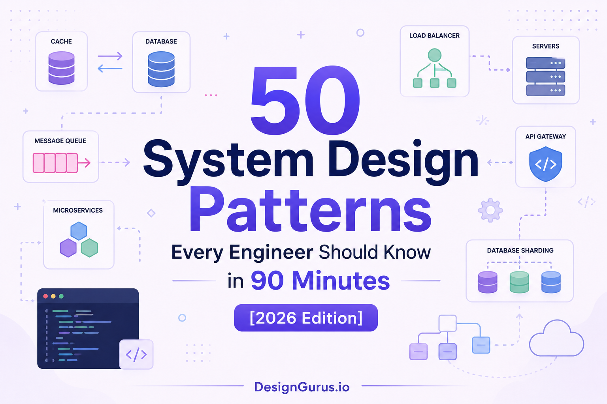
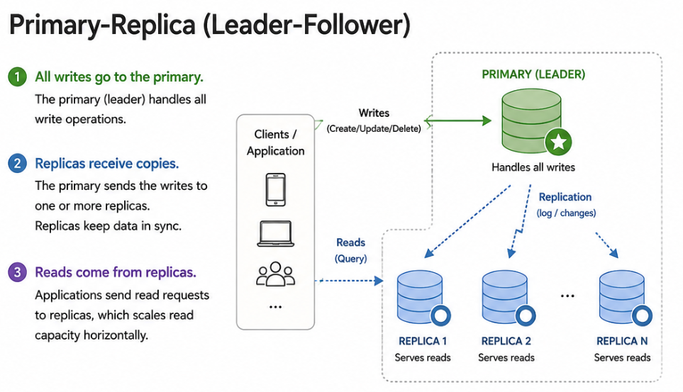
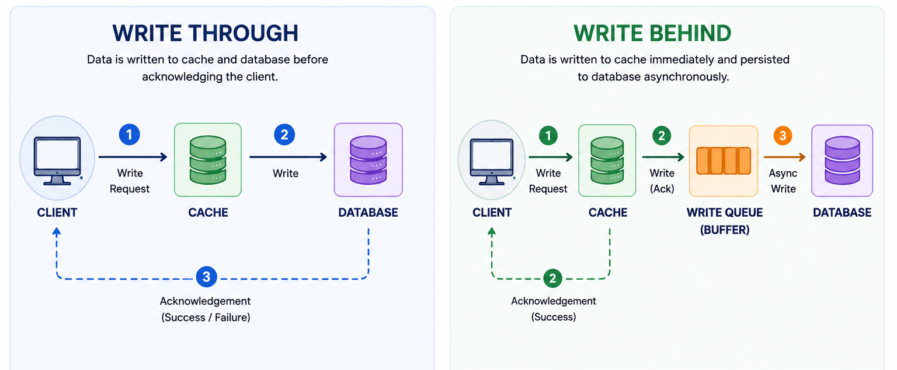
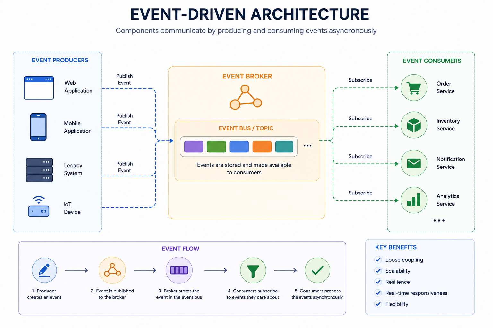
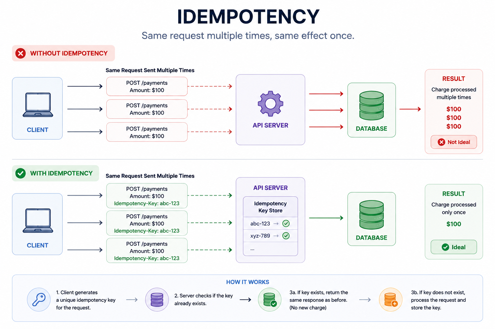
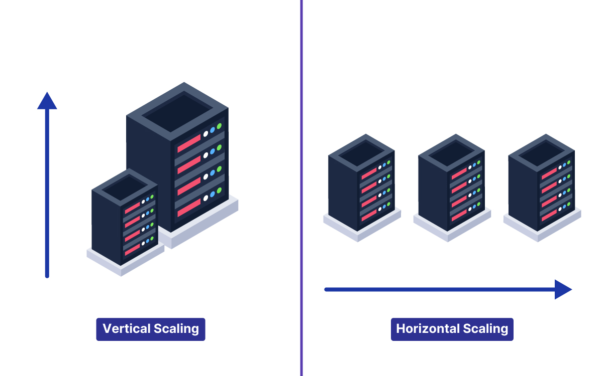
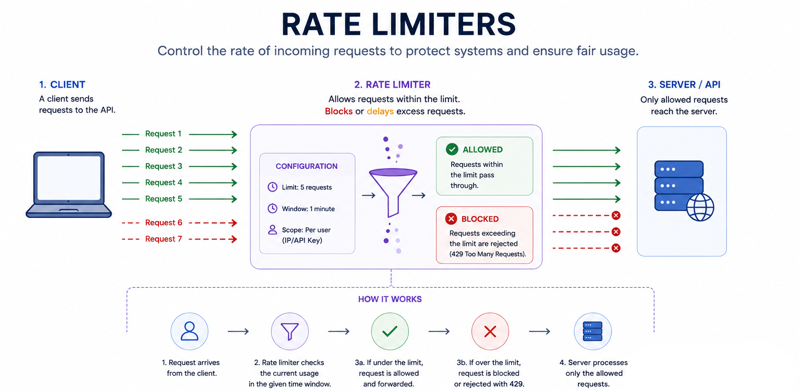
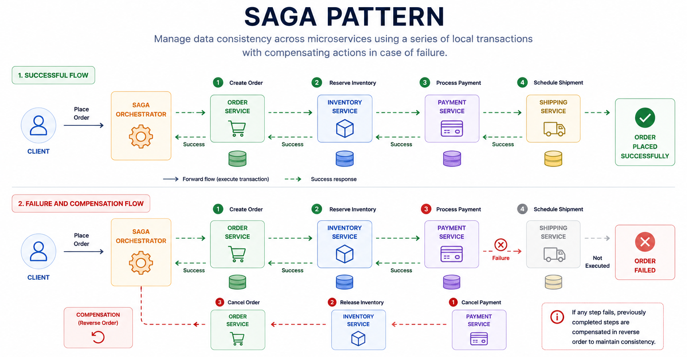

# 50 System Design Patterns Every Engineer Should Know in 90 Minutes [2026 Edition]

- **Source:** [System Design Nuggets (Substack)](https://designgurus.substack.com/p/50-system-design-patterns-every-engineer)
- **Author:** Arslan Ahmad
- **Published:** May 11, 2026

---

A comprehensive reference of 50 system design patterns organized into 10 categories. Each pattern is explained in 2-3 sentences: what it does, when to use it, and the trade-off — with real-world examples.

## The 10 Categories

### 1. Data Storage Patterns (1-6)
Primary-Replica, Sharding, Consistent Hashing, Write-Ahead Log, Event Sourcing, CQRS

### 2. Caching Patterns (7-11)
Cache-Aside, Write-Through, Write-Behind, Read-Through, Cache Stampede Prevention

### 3. Communication Patterns (12-18)
Request-Response, Message Queue, Pub/Sub, Event-Driven Architecture, Webhooks, SSE, Bidirectional Streaming

### 4. Reliability Patterns (19-25)
Circuit Breaker, Retry with Exponential Backoff, Bulkhead, Timeout, Idempotency, Dead Letter Queue, Graceful Degradation

### 5. Scaling Patterns (26-30)
Horizontal Scaling, Vertical Scaling, Load Balancing, Auto-Scaling, Connection Pooling

### 6. Data Processing Patterns (31-34)
MapReduce, Stream Processing, Lambda Architecture, Change Data Capture (CDC)

### 7. API Design Patterns (35-39)
API Gateway, Backend for Frontend (BFF), Rate Limiting, Cursor Pagination, API Versioning

### 8. Infrastructure Patterns (40-43)
CDN, Reverse Proxy, Service Mesh, Sidecar Pattern

### 9. Consistency Patterns (44-47)
Two-Phase Commit (2PC), Saga Pattern, Quorum, Vector Clocks

### 10. Observability & Operations Patterns (48-50)
Health Check Endpoint, Distributed Tracing, Canary Deployment

## Key Concepts

**Interview Mental Model** — 5 questions to generate any system design skeleton:
1. How does data flow? → Communication patterns
2. How is data stored? → Storage patterns
3. How is data accessed quickly? → Caching patterns
4. How does the system survive failures? → Reliability patterns
5. How does the system grow? → Scaling patterns

**Top 15 Most-Tested Patterns:** Primary-Replica, Sharding, Consistent Hashing, Cache-Aside, Cache Stampede Prevention, Message Queue, Pub/Sub, Circuit Breaker, Retry with Backoff, Idempotency, Horizontal Scaling, Load Balancing, Auto-Scaling, API Gateway, Rate Limiting

## Nguồn

- [Raw Source](../../raw/50_system_design_patterns_20260514.md)
- [Consistent Hashing Diagram](../media/design_pattern_consistent_hashing.png)

## Liên kết liên quan

- [The Anatomy of an Agent Harness](./agent_harness.md) — Agent infrastructure patterns
- [Choosing the Right Agentic Design Pattern](./agentic_design_patterns_decision_tree.md) — Agent-specific design patterns
- [Building AI Applications](../topics/Building_AI_applications.md) — AI application engineering
