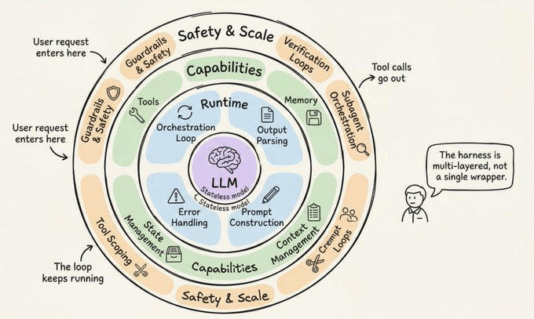

# The Anatomy of an Agent Harness

**Author**: Avi Chawla  
**Source**: Daily Dose of Data Science  
**Date**: Apr 7, 2026

## Overview

Deep dive into what Anthropic, OpenAI, Perplexity and LangChain are actually building when they create "agents".

> "If you're not the model, you're the harness."

The **agent** is the emergent behavior (goal-directed, tool-using, self-correcting). The **harness** is the machinery producing that behavior.

## 11 Components of Production Harness

1. **Orchestration Loop** - ReAct loop, TAO cycle
2. **Tools** - file ops, search, execution, web access
3. **Memory** - short-term (session), long-term (cross-session)
4. **Context Management** - compaction, observation masking, JIT retrieval
5. **Prompt Construction** - hierarchical assembly
6. **Output Parsing** - native tool calling
7. **State Management** - typed dictionaries, checkpointing
8. **Error Handling** - transient, LLM-recoverable, user-fixable
9. **Guardrails** - input/output/tool guardrails
10. **Verification Loops** - rules-based, visual, LLM-as-judge
11. **Subagent Orchestration** - Fork, Teammate, Worktree

## Key Frameworks

- **Anthropic Claude Agent SDK**: Gather-Act-Verify cycle
- **OpenAI Agents SDK**: Runner class, code-first
- **LangGraph**: Explicit state graph
- **CrewAI**: Role-based multi-agent

## Seven Design Decisions

1. Single-agent vs multi-agent
2. ReAct vs plan-and-execute
3. Context window management
4. Verification loop design
5. Permission architecture
6. Tool scoping strategy
7. Harness thickness

## Key Takeaways

- The harness is where the hard engineering lives
- Changing only the harness moved agents 20+ rankings on TerminalBench
- Field moving toward thinner harnesses as models improve
- Models are post-trained with specific harnesses

---

## Related Topics

- [Builder Agents](../topics/builder_agents.md)
- [Agent Skills](../topics/agent_skills.md)

---

## Source

- [Article](https://www.dailydoseofds.com/p/the-anatomy-of-an-agent-harness/)