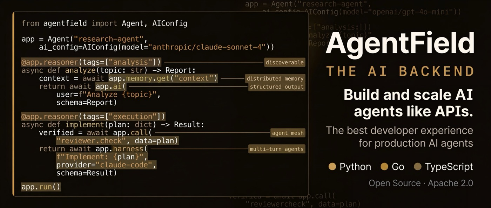
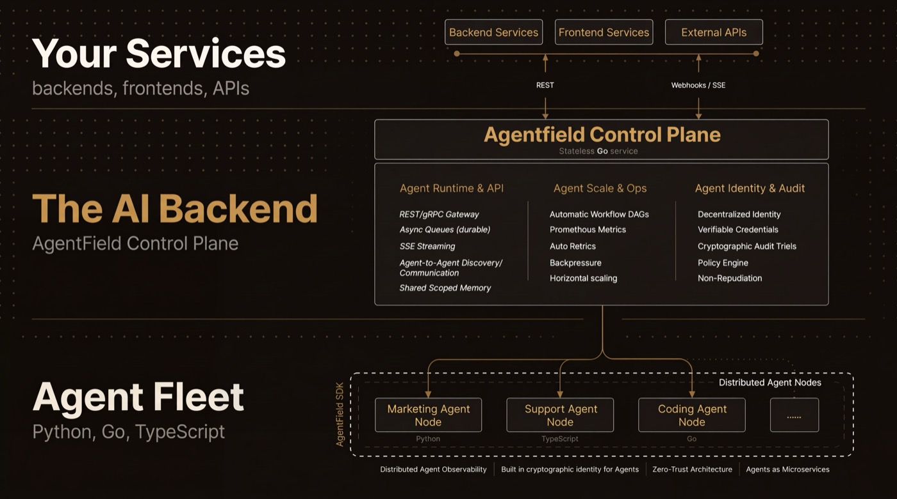

# AgentField — The AI Backend

- **Source:** [github.com/Agent-Field/agentfield](https://github.com/Agent-Field/agentfield)
- **Stars:** 1.8k | **License:** Apache 2.0 | **Latest:** v0.1.84 (May 11, 2026)
- **Forks:** 290 | **Commits:** 1,029 | **Languages:** Go, TypeScript, Python



Repository AgentField/agentfield là một nền tảng điều khiển (control plane) mã nguồn mở được thiết kế theo phong cách Kubernetes dành cho các AI Agent. Nó cho phép bạn xây dựng, vận hành và mở rộng các hệ thống đa tác nhân (multi-agent systems) giống như các microservices hoặc API truyền thống.

[GitHub](https://github.com/Agent-Field/agentfield) | [Docs](https://agentfield.ai/docs/learn) | [Discord](https://discord.gg/aBHaXMkpqh)

## Mục tiêu cốt lõi

AgentField giúp chuyển đổi các kịch bản AI (scripts) hoặc các chatbot đơn lẻ thành hạ tầng sản xuất chuyên nghiệp. Thay vì chỉ gửi prompt, bạn có thể triển khai các agent có khả năng:

- **Có danh tính thực thụ**: Mỗi agent được cấp một định danh mật mã (W3C DID) thay vì chỉ dùng chung API key.
- **Có khả năng kiểm chứng**: Mọi quyết định và hành động của agent đều được lưu lại dưới dạng dấu vết (audit trails) không thể giả mạo.
- **Kết nối linh hoạt**: Agent có thể được gọi bởi frontend, backend, các agent khác hoặc chạy theo lịch (cron jobs).

## Triết lý cốt lõi

Triết lý cốt lõi của AgentField có thể được tóm gọn trong một câu: *"Đưa AI Agent vào khuôn khổ quản trị của kỹ thuật phần mềm truyền thống."*

Thay vì coi Agent là một đoạn code script chạy tự do, AgentField đối xử với chúng như những **Công dân hạng nhất** (First-class citizens) trong hệ thống hạ tầng. Dưới đây là 3 trụ cột triết lý chính:

### 1. "Agentic System as a Service" (Hệ thống Agent như một dịch vụ)

AgentField không cố gắng thay thế các framework xây dựng Agent hiện có (như LangChain hay AutoGPT). Thay vào đó, nó đóng vai trò là lớp hạ tầng (Infrastructure Layer).

- **Triết lý**: Một Agent mạnh mẽ không chỉ nằm ở Prompt hay LLM, mà nằm ở khả năng vận hành (Operationalization).
- **Cách tiếp cận**: Nó cung cấp khả năng tự động hóa việc triển khai, quản lý vòng đời (lifecycle), và cung cấp API để các Agent có thể tương tác với nhau như các microservices.

### 2. Sự tin cậy qua Khả năng kiểm chứng (Trust through Verifiability)

Trong thế giới AI, sự "mập mờ" (black box) là rào cản lớn nhất để đưa vào sản xuất. AgentField giải quyết điều này bằng triết lý "Tin tưởng nhưng phải xác minh".

- **Cấp danh tính (Identity)**: Mỗi Agent có một chữ ký điện tử (DID). Bạn biết chính xác ai đã thực hiện hành động đó.
- **Dấu vết hành động (Traceability)**: Mọi quyết định của Agent không chỉ là log văn bản, mà là các hồ sơ có thể kiểm chứng. Điều này giúp doanh nghiệp giải trình được tại sao Agent lại đưa ra hành động đó (Compliance & Audit).

### 3. Kiểm soát tập trung - Thực thi phi tập trung (Centralized Control, Decentralized Execution)

AgentField vay mượn tư duy từ Kubernetes để quản lý sự hỗn loạn của các Agent.

- **Control Plane**: Một trung tâm điều khiển duy nhất để quản lý chính sách (policies), bảo mật và giám sát.
- **Runtime linh hoạt**: Các Agent có thể chạy ở bất cứ đâu (máy cục bộ, server riêng, cloud) nhưng vẫn nằm dưới sự điều phối chung. Điều này giúp hệ thống có khả năng mở rộng (scalability) cực cao mà không mất đi sự kiểm soát.

### Tóm lại: Triết lý "Cloud-Native AI"

AgentField tin rằng tương lai của AI không phải là những chatbot đơn lẻ, mà là những "đội quân Agent" hoạt động có tổ chức. Để làm được điều đó, chúng ta cần một hệ điều hành chung cho chúng — và AgentField chính là nỗ lực để xây dựng "hệ điều hành" đó.

## Kiến trúc hệ thống (3 thành phần chính)

Repo này được cấu trúc theo dạng monorepo bao gồm:

- **Control Plane (Go)**: Trung tâm điều phối, cung cấp REST/gRPC API, quản lý quy trình công việc (workflows), khả năng quan sát (observability) và danh tính mật mã.
- **SDKs (Python, Go, TypeScript)**: Thư viện để các nhà phát triển viết logic cho agent. Ví dụ, trong Python, bạn chỉ cần dùng các decorator để biến các hàm logic thành các endpoint REST.
- **Web UI (React/TypeScript)**: Giao diện quản trị để giám sát các luồng công việc và trạng thái của các agent trong thời gian thực.

## Tính năng kỹ thuật đáng chú ý

- **Giao tiếp qua Control Plane**: Các agent không gọi trực tiếp lẫn nhau qua HTTP mà đi qua trung tâm điều khiển để hệ thống có thể theo dõi biểu đồ thực thi (DAG) và tiêm các số liệu đo lường.
- **Chế độ lưu trữ**: Hỗ trợ từ SQLite (cho phát triển nội bộ) đến PostgreSQL (cho môi trường production).
- **Phân quyền dựa trên chính sách**: Bạn có thể quy định "Chỉ những agent có tag 'tài chính' mới được gọi hàm này" và hệ thống sẽ thực thi điều đó bằng chữ ký mật mã.



## Hệ sinh thái liên quan

AgentField không chỉ đứng một mình mà có các dự án vệ tinh đi kèm để minh họa sức mạnh:

- **SWE-AF**: Một "đội quân" agent kỹ sư phần mềm có thể tự lập kế hoạch, viết code, kiểm thử và tạo PR.
- **HUNT/PROVE**: Agent chuyên về bảo mật, quét và xác minh các lỗ hổng hệ thống.
- **Deep Research**: Hệ thống triển khai hàng ngàn agent cùng lúc để nghiên cứu sâu một chủ đề.

## Tình trạng dự án

- **Ngôn ngữ chính**: Go (backend trung tâm) và Python/TypeScript (SDK).
- **Giấy phép**: Apache 2.0 (Mã nguồn mở hoàn toàn).
- **Cộng đồng**: Đang phát triển nhanh với các bản cập nhật liên tục về khả năng tích hợp các mô hình như Claude, OpenAI, Gemini.

## Quick Start

```bash
curl -fsSL https://agentfield.ai/install.sh | bash
af init my-agent --defaults
cd my-agent && pip install -r requirements.txt
af server  # Dashboard at localhost:8080
python main.py  # Agent auto-registers
```

## Nguồn

- [Raw Source](../../raw/agentfield_20260514.md)
- [GitHub Repository](https://github.com/Agent-Field/agentfield)
- [Documentation](https://agentfield.ai/docs/learn)

## Liên kết liên quan

- [Building Agent Apps](../topics/building_agent_apps.md)
