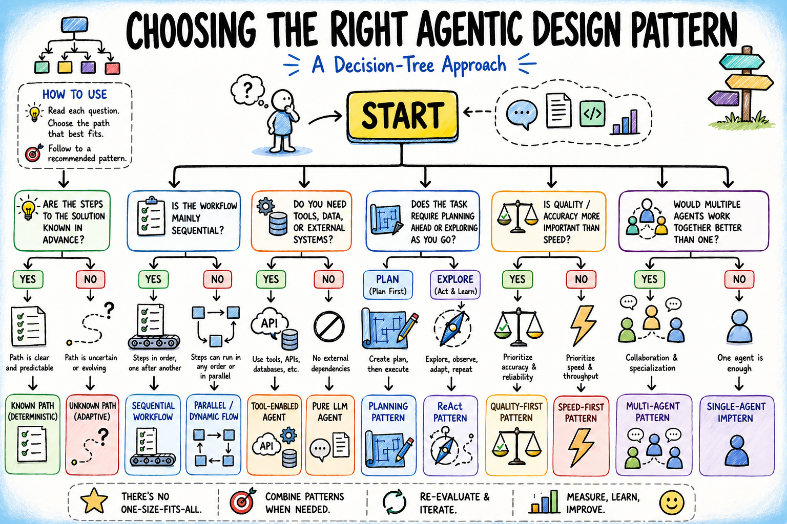
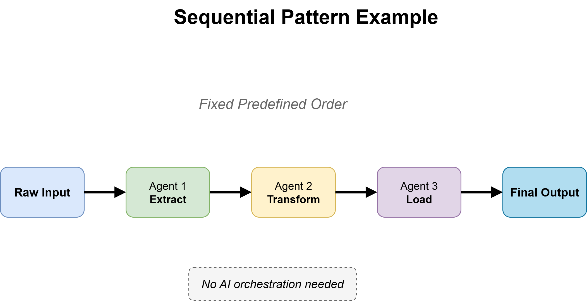
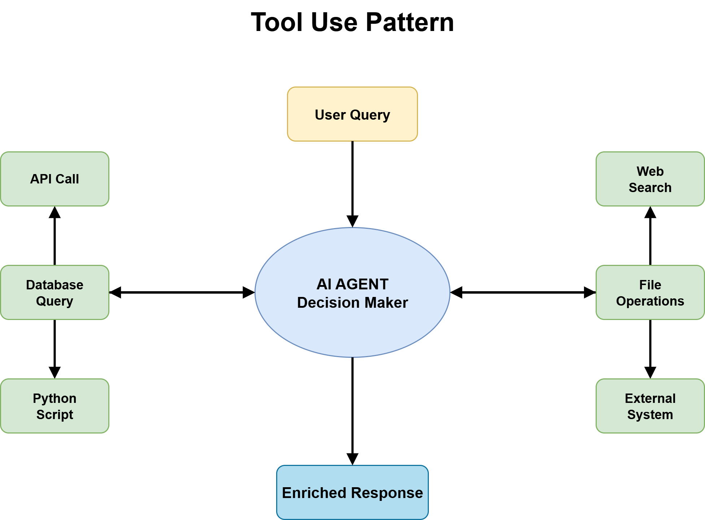
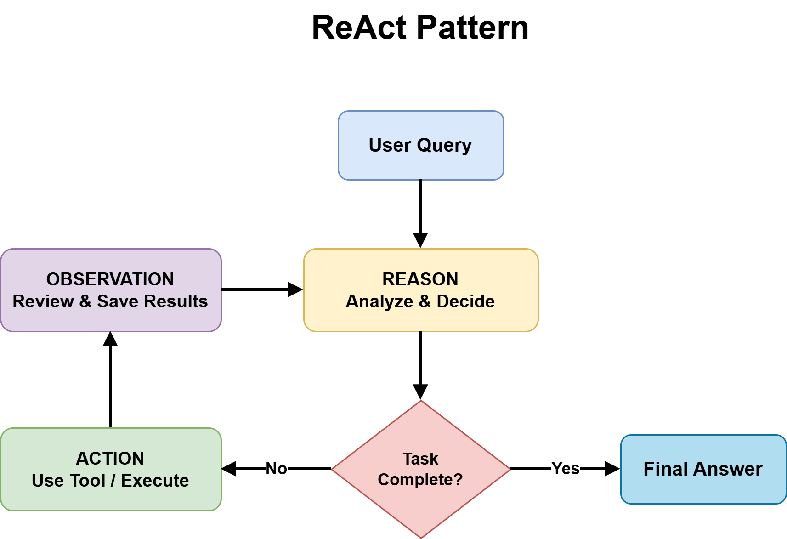
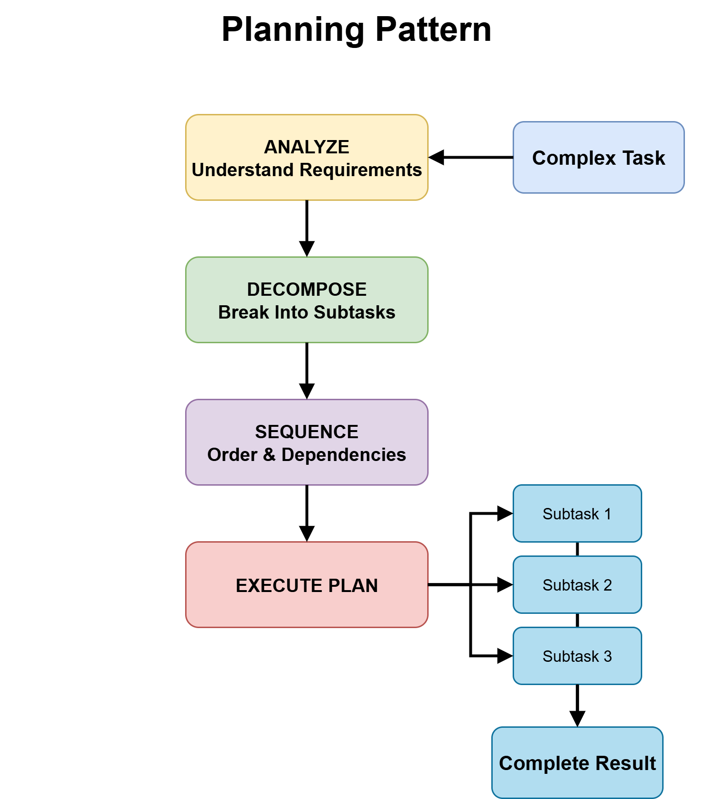
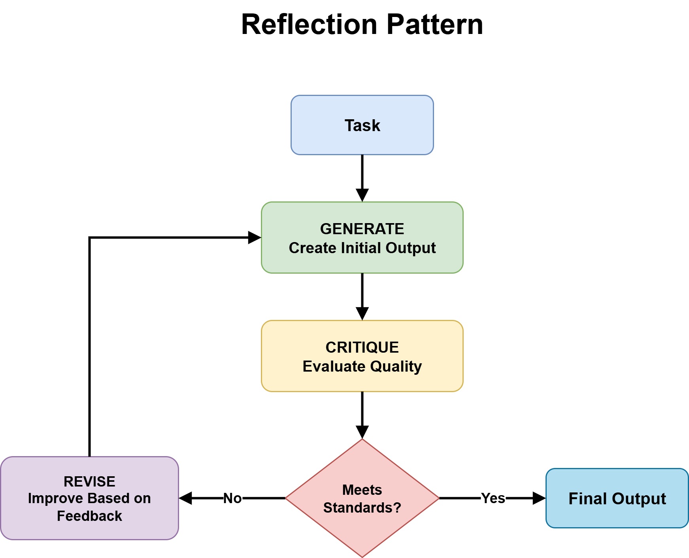
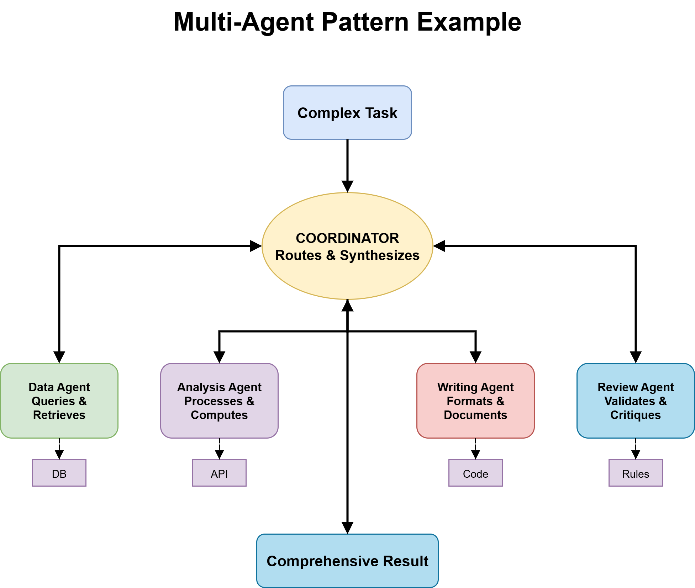
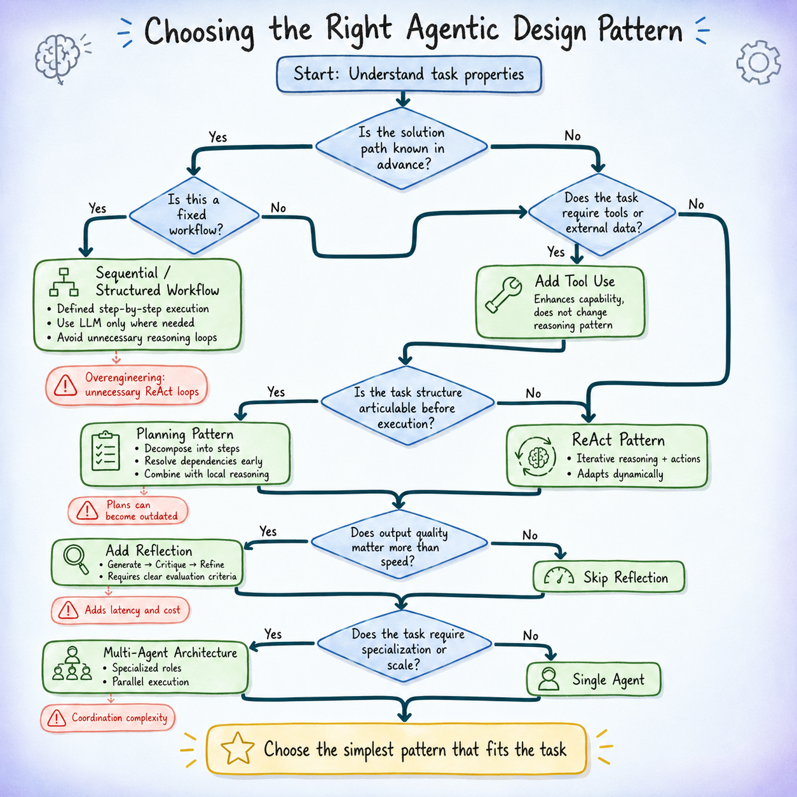

# Choosing the Right Agentic Design Pattern: A Decision-Tree Approach

- **Author**: Bala Priya C (Machine Learning Mastery)

Structured decision tree with 5 branching questions to choose the right agentic design pattern — from fixed workflows to multi-agent systems.

## Overview

Most agentic architecture mistakes start with picking a pattern based on what looks impressive rather than what the task needs. This article provides a **decision tree** with five branching questions that map concrete task properties to the most appropriate starting pattern.

## The 5-Question Decision Tree

### Q1: Is the Solution Path Known in Advance?
- **Yes** → Q2a (fixed workflow? → Sequential Workflow)
- **No** → Q2b (need tools? → assume tool use)

### Q2b: Does the Task Require Tool Access?
Almost always yes. Tool use sits under the reasoning layer.

### Q3: Is the Task Structure Articulable Before Execution?
- **Yes** → Planning + ReAct inside steps
- **No** → ReAct (then Q4)

### Q4: Does Output Quality Matter More Than Speed?
- **Yes** → Add Reflection
- **No** → Skip to Q5

### Q5: Specialization or Scale Problem?
- **Yes** → Multi-Agent System
- **No** → Single Agent is enough

## Pattern Summary

| Pattern | Best For |
|---------|----------|
| **Single Agent + Tools + ReAct** | Unknown path, no clear structure, no strict quality constraints |
| **Planning Agent + ReAct Execution** | Task structure knowable upfront, adaptive steps needed |
| **Single Agent + Reflection** | High-quality output required, latency acceptable |
| **Multi-Agent Specialist System** | Strong specialization needs or scale exceeds single agent |

## Common Pitfalls

- ReAct looping → needs planning
- Planning abandoned → less structured than assumed
- Reflection not improving → unclear evaluation criteria
- Multi-agent routing failures → use deterministic rules

## Patterns Covered

*Sequential workflow pattern*

*Tool use pattern*

*ReAct pattern*

*Planning pattern*

*Reflection pattern*

*Multi-Agent pattern*

*Complete decision tree flowchart*

---

## Source

- [Raw Source](../../raw/agentic_design_patterns_decision_tree_20260512.md)
- [Original Article](https://machinelearningmastery.com/choosing-the-right-agentic-design-pattern-a-decision-tree-approach/)

## Related Topics

- [Building Agent Apps](../topics/building_agent_apps.md) — Agent Patterns section
- [Agent Harness](../sources/agent_harness.md) — Agent architecture deep dive
