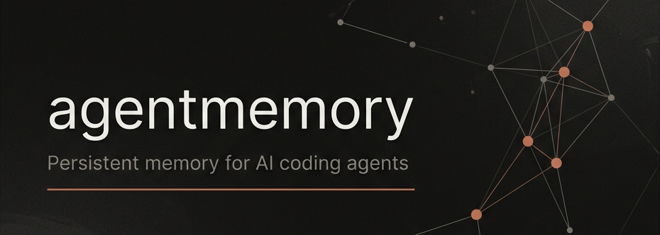

# agentmemory

- **Type**: Persistent Memory for AI Coding Agents
- **Slogan**: "Your coding agent remembers everything. No more re-explaining."



#1 persistent memory for AI coding agents based on real-world benchmarks. Automatic capture via 12 hooks, hybrid search (BM25 + Vector + Graph) with **95.2% R@5** on LongMemEval-S, and 51 MCP tools — zero external databases.

## Details

- **Org**: rohitg00
- **License**: Apache-2.0
- **GitHub**: [https://github.com/rohitg00/agentmemory](https://github.com/rohitg00/agentmemory)
- **Stars**: 6.5k+
- **npm**: [@agentmemory/agentmemory](https://www.npmjs.com/package/@agentmemory/agentmemory)
- **Website**: [agent-memory.dev](https://agent-memory.dev)

## Key Features

- **Automatic Capture** — 12 lifecycle hooks silently record every tool use, session context, and file access
- **Hybrid Search** — BM25 + Vector + Knowledge Graph fused with Reciprocal Rank Fusion (RRF, k=60)
- **4-Tier Memory Consolidation** — Working (raw) → Episodic (summaries) → Semantic (facts) → Procedural (workflows)
- **51 MCP Tools** — memory_recall, memory_save, memory_smart_search, memory_sessions, memory_profile, memory_relations, and 45+ more
- **12 Hooks** — SessionStart, UserPromptSubmit, PreToolUse, PostToolUse, PostToolUseFailure, PreCompact, Stop, SessionEnd, and more
- **Token Efficient** — ~1,900 tokens/session ($10/yr), **92% fewer** vs raw context
- **No External DBs** — SQLite + iii-engine (Rust), zero infrastructure dependencies
- **Privacy First** — SHA-256 dedup, strips secrets/API keys, `<private>` tag support

## Benchmarks

| Metric | agentmemory | mem0 (53K⭐) | Letta (22K⭐) |
|--------|-------------|-------------|---------------|
| Retrieval R@5 | **95.2%** | 68.5% | 83.2% |
| Retrieval R@10 | **98.6%** | — | — |
| MRR | **88.2%** | — | — |
| Tokens/session | ~1,900 ($10/yr) | Varies | 22K+ at 240 obs |
| External DBs | **None** (SQLite) | Qdrant/pgvector | Postgres + vector |

## Memory Pipeline

```
PostToolUse → SHA-256 dedup → Privacy filter → Store raw observation
  → LLM compress → structured facts + concepts + narrative
  → Vector embedding → Index in BM25 + vector

SessionEnd → Summarize session → Knowledge graph extraction → Slot reflection
SessionStart → Load project profile → Hybrid search → Inject into context
```

## Supported Agents

Claude Code, Cursor, Gemini CLI, Codex CLI, OpenClaw, Hermes, Cline, Roo Code, Windsurf, Goose, Aider, Claude Desktop, Kilo Code, OpenCode, pi — any MCP or REST client.

## Quick Start

```bash
# Start the memory server
npx @agentmemory/agentmemory

# Seed demo and open viewer
npx @agentmemory/agentmemory demo
open http://localhost:3113
```

## MCP Server

```json
{
  "mcpServers": {
    "agentmemory": {
      "command": "npx",
      "args": ["-y", "@agentmemory/mcp"],
      "env": {
        "AGENTMEMORY_URL": "http://localhost:3111"
      }
    }
  }
}
```

---

## Source

- [Raw Source](../../raw/agentmemory_20260512.md)
- [GitHub Repository](https://github.com/rohitg00/agentmemory)
- [npm Package](https://www.npmjs.com/package/@agentmemory/agentmemory)

## Related Topics

- [Building Agent Apps](../topics/building_agent_apps.md) — Agent Memory section
