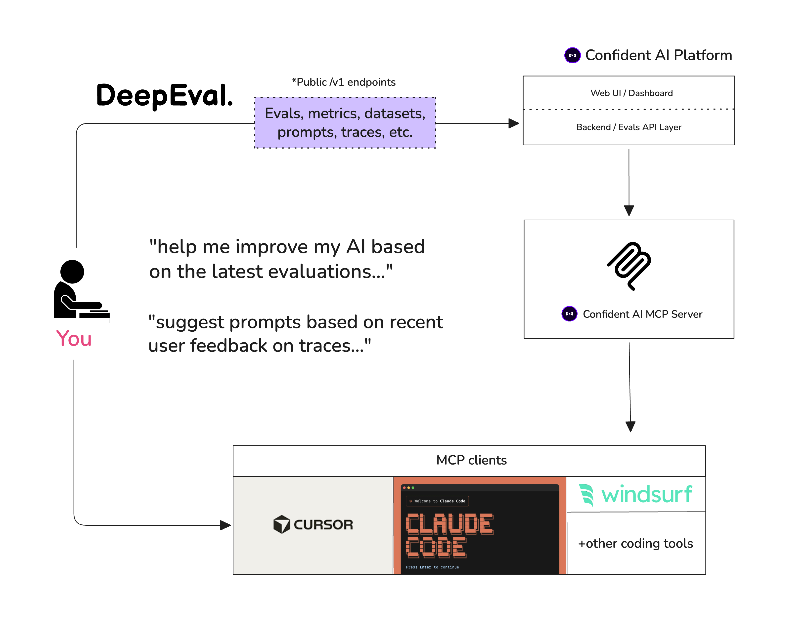

# DeepEval

- **Source:** [github.com/confident-ai/deepeval](https://github.com/confident-ai/deepeval)
- **Stars:** 15.4k | **License:** Apache 2.0 | **Latest:** v4.0.2 (May 13, 2026)
- **Forks:** 1.4k | **Commits:** 9,447 | **Language:** Python 3.9+

The LLM Evaluation Framework — Pytest-like unit testing framework specialized for LLM apps. Supports evaluating AI agents, RAG pipelines, chatbots, and multimodal systems using LLM-as-a-judge metrics that run locally.

[GitHub](https://github.com/confident-ai/deepeval) | [Docs](https://deepeval.com) | [Discord](https://discord.gg/3SEyvpgu2f)

## Overview

DeepEval is an open-source LLM evaluation framework similar to Pytest but specialized for unit testing LLM applications. It incorporates the latest research to run evals via metrics powered by **any** LLM of choice, statistical methods, or NLP models running **locally on your machine**.

## Key Features

- **30+ Metrics**: Covers agentic, RAG, multi-turn, MCP, multimodal, and general-purpose evaluation
- **CI/CD Native**: Integrates seamlessly with any CI/CD environment
- **Synthetic Data Generation**: Generate single and multi-turn datasets for evaluation
- **Prompt Optimization**: Auto-optimize prompts based on evaluation results
- **LLM Benchmarking**: Benchmark any LLM on MMLU, HellaSwag, DROP, BIG-Bench Hard, TruthfulQA, HumanEval, GSM8K in under 10 lines
- **Full Traceability**: `evals_iterator()` with observability decorators for end-to-end tracing

## Metric Categories

| Category | Metrics |
|----------|---------|
| **Custom** | G-Eval (LLM-as-a-judge), DAG (graph-based) |
| **Agentic** | Task Completion, Tool Correctness, Goal Accuracy, Step Efficiency, Plan Adherence, Plan Quality, Tool Use, Argument Correctness |
| **RAG** | Answer Relevancy, Faithfulness, Contextual Recall, Contextual Precision, Contextual Relevancy, RAGAS |
| **Multi-Turn** | Knowledge Retention, Conversation Completeness, Turn Relevancy, Turn Faithfulness, Role Adherence |
| **MCP** | MCP Task Completion, MCP Use, Multi-Turn MCP Use |
| **Multimodal** | Text to Image, Image Editing, Image Coherence, Image Helpfulness, Image Reference |
| **Other** | Hallucination, Summarization, Bias, Toxicity, JSON Correctness, Prompt Alignment |

## Framework Integrations

Supports 11+ frameworks: OpenAI, OpenAI Agents, LangChain, LangGraph, Pydantic AI, CrewAI, Anthropic, AWS AgentCore, LlamaIndex, Google ADK, Strands.

## Platform Integration (Confident AI)

Confident AI is the native platform for DeepEval — manage datasets, trace LLM apps, run evaluations, monitor production. Also provides an MCP server for IDE integration (Claude Code, Cursor).

## Nguồn

- [Raw Source](../../raw/deepeval_20260514.md)
- [GitHub Repository](https://github.com/confident-ai/deepeval)
- [Documentation](https://deepeval.com)

## Liên kết liên quan

- [Generative AI and LLM](../topics/llm.md)
