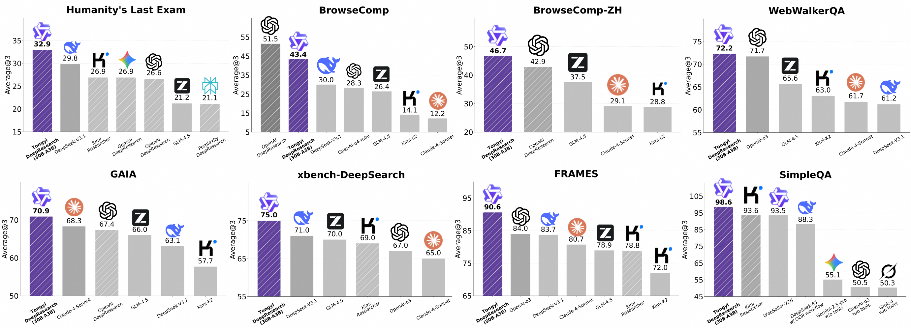
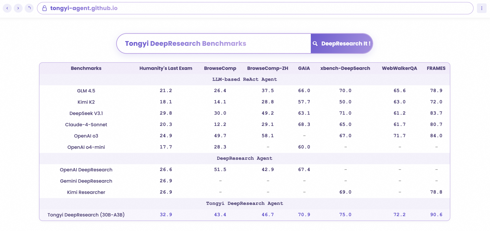

# DeepResearch — Tongyi Deep Research

- **Source:** [github.com/Alibaba-NLP/DeepResearch](https://github.com/Alibaba-NLP/DeepResearch)
- **Stars:** 18.9k | **License:** Apache 2.0 | **Forks:** 1.5k | **Commits:** 300
- **Model:** Tongyi-DeepResearch-30B-A3B (30B total, 3.3B activated/token, 128K context)


The leading open-source deep research agent, developed by Tongyi Lab (Alibaba). Designed for long-horizon, deep information-seeking tasks with state-of-the-art performance on Humanity's Last Exam, BrowseComp, BrowseComp-ZH, WebWalkerQA, and more.

[GitHub](https://github.com/Alibaba-NLP/DeepResearch) | [Paper](https://arxiv.org/pdf/2510.24701) | [Blog](https://tongyi-agent.github.io/blog/introducing-tongyi-deep-research/) | [HuggingFace](https://huggingface.co/Alibaba-NLP/Tongyi-DeepResearch-30B-A3B)

## Overview

Tongyi DeepResearch is a MoE (Mixture-of-Experts) agentic LLM with 30.5B total parameters (3.3B activated per token) and 128K context window. It builds upon the WebAgent project series from Tongyi Lab and achieves SOTA across multiple agentic search benchmarks.



## Key Features

- **Automated Data Synthesis** — Fully automatic pipeline for agentic pre-training, SFT, and RL data
- **Continual Pre-training** — Large-scale agentic interaction data for extended capabilities
- **End-to-end RL** — Custom GRPO with token-level policy gradients, leave-one-out advantage estimation
- **Dual Inference Modes** — ReAct (core evaluation) and IterResearch Heavy mode (test-time scaling)

## Benchmarks

SOTA on: Humanity's Last Exam, BrowseComp, BrowseComp-ZH, WebWalkerQA, xbench-DeepSearch, FRAMES, SimpleQA.



## Deep Research Agent Family

Includes 18+ research papers: WebWalker (ACL 2025), WebDancer (NeurIPS 2025), WebSailor, WebShaper, WebWatcher, WebResearcher, ReSum, WebWeaver, AgentFold, WebLeaper, BrowseConf, ParallelMuse, AgentFrontier, etc.

## Quick Start

```bash
conda create -n react_infer_env python=3.10.0
pip install -r requirements.txt
cp .env.example .env
# Configure API keys: Serper.dev, Jina.ai, OpenAI, Dashscope, SandboxFusion
bash run_react_infer.sh
```

Also available on OpenRouter for GPU-free inference.

## Nguồn

- [Raw Source](../../raw/deepresearch_20260514.md)
- [GitHub Repository](https://github.com/Alibaba-NLP/DeepResearch)
- [Technical Report](https://arxiv.org/pdf/2510.24701)

## Liên kết liên quan

- [Research Agents](../topics/Research_agents.md)
- [Alibaba NLP (Tongyi Lab)](../entities/alibaba_nlp.md)
