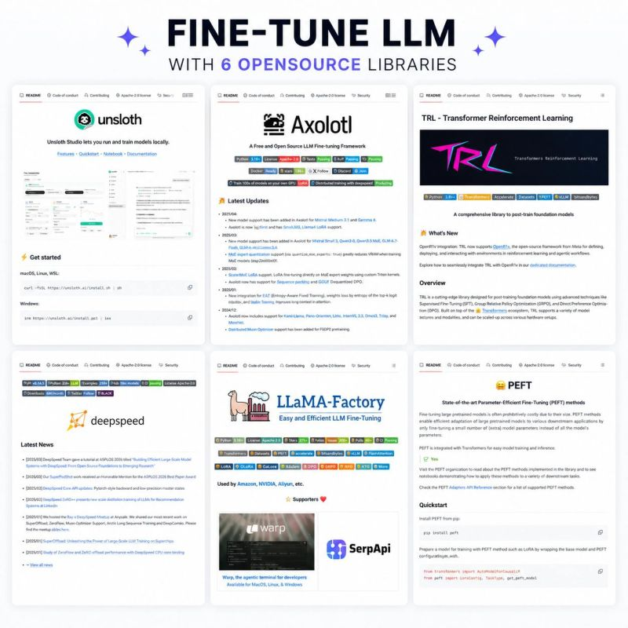

# 6 Open-Source Libraries to FineTune LLMs

Curated list of 6 essential open-source libraries for fine-tuning LLMs, covering low VRAM optimization, RLHF alignment, distributed training, and parameter-efficient fine-tuning.

## 1. Unsloth

**GitHub**: [unslothai/unsloth](https://github.com/unslothai/unsloth)

- **Fastest local fine-tuning** for LLMs
- **Low VRAM optimized** — runs on laptops
- **Plug-and-play** with Hugging Face models
- Uses custom Triton kernels for 2x speed and 60% memory reduction

## 2. Axolotl

**GitHub**: [OpenAccess-AI-Collective/axolotl](https://github.com/OpenAccess-AI-Collective/axolotl)

- **Flexible YAML configs** for fine-tuning pipelines
- **LoRA, QLoRA, multi-GPU** support
- Great for custom training pipelines with complex schedules
- Used extensively in open-source model training community

## 3. TRL (Transformer Reinforcement Learning)

**GitHub**: [huggingface/trl](https://github.com/huggingface/trl)

- **RLHF, DPO, PPO, ORPO** for LLM alignment
- Built on Hugging Face ecosystem (Transformers + PEFT + Accelerate)
- Essential for post-training optimization and preference alignment
- Supports SFT, DPO, KTO, and other training paradigms

## 4. DeepSpeed

**GitHub**: [microsoft/DeepSpeed](https://github.com/microsoft/DeepSpeed)

- **Distributed training** for massive models
- **ZeRO** (Zero Redundancy Optimizer) for memory optimization
- DeepSpeed Chat for RLHF pipelines
- Industry standard for scaling training across GPUs/nodes

## 5. LLaMA-Factory

**GitHub**: [hiyouga/LLaMA-Factory](https://github.com/hiyouga/LLaMA-Factory)

- **All-in-one fine-tuning** with Web UI + CLI
- **Supports 100+ models**: LLaMA, Qwen, Mistral, Gemma, Yi, etc.
- **Beginner-friendly** yet powerful for advanced users
- Supports LoRA, QLoRA, full fine-tuning, merge, and export

## 6. PEFT (Parameter-Efficient Fine-Tuning)

**GitHub**: [huggingface/peft](https://github.com/huggingface/peft)

- **Minimal compute** fine-tuning methods
- **LoRA, Adapters, Prefix Tuning**, Prompt Tuning, IA3
- Best for cost-efficient training on consumer hardware
- Integrated with Transformers for seamless use

## Comparison Summary

| Library | Best For | Key Strength | Difficulty |
|---|---|---|---|
| Unsloth | Speed + low VRAM | Custom Triton kernels, 2x faster | Easy |
| Axolotl | Custom pipelines | YAML configs, flexible scheduling | Medium |
| TRL | Post-training alignment | RLHF, DPO, PPO | Advanced |
| DeepSpeed | Distributed scaling | ZeRO optimizer, multi-node | Advanced |
| LLaMA-Factory | All-in-one solution | Web UI, 100+ model support | Easy |
| PEFT | Parameter efficiency | LoRA, adapters, minimal compute | Easy |

## When to Use Each

- **Start with LLaMA-Factory** if you're a beginner or want a quick UI
- **Use Unsloth** when fine-tuning on consumer GPUs/laptops
- **Choose Axolotl** for custom training pipelines with complex configurations
- **Use TRL** for RLHF and preference alignment after SFT
- **Use DeepSpeed** for training large models across multiple GPUs/nodes
- **Use PEFT** as the foundation for any parameter-efficient approach

## Nguồn

- [6 Open-Source Libraries to FineTune LLMs Raw](../../raw/llm_finetune_libraries_20260504.md)

## Liên kết liên quan

- [Building AI Applications](../topics/Building_AI_applications.md) - Topic covering AI development
- [AI Fundamental](../topics/foundation_models.md) - Foundation models overview
- [Self-Learning](../topics/self_learning.md) - Learning resources
