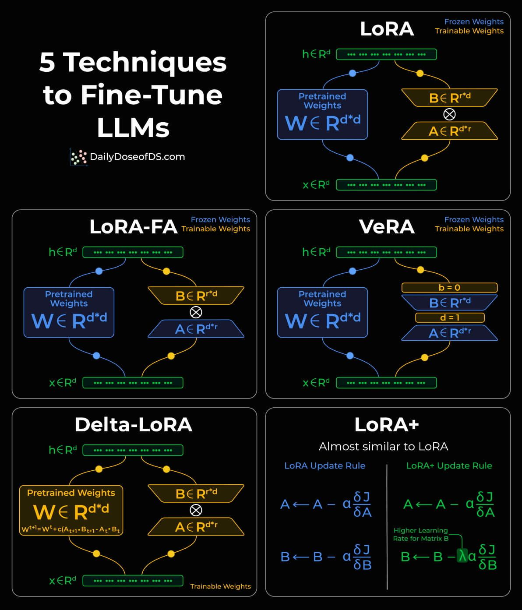

# Top 5 LLM Fine-Tuning Techniques

Tổng quan 5 kỹ thuật fine-tuning hiệu quả tham số (PEFT) cho LLM, từ LoRA đến LoRA+, kèm giải thích trực quan.

## Background

Traditional fine-tuning is impractical for LLMs (billions of params; 100s GB). Parameter-efficient finetuning (PEFT) solves this by finding lower-rank adaptations of weight matrices.

## Techniques

### 1) LoRA (Low-Rank Adaptation)

Add two low-rank trainable matrices **A** and **B** alongside weight matrices. Instead of fine-tuning W directly, updates are learned in these low-rank matrices. Even for the largest LLMs, LoRA matrices take up only a few MBs of memory.

### 2) LoRA-FA (Frozen-A)

LoRA requires substantial activation memory to update low-rank weights. LoRA-FA freezes matrix **A** and only updates matrix **B**, reducing activation memory.

### 3) VeRA (Vector-based Random Matrix Adaptation)

In LoRA, A and B are unique per layer. In VeRA, A and B are **frozen, random, and shared across all layers**. Instead, it learns layer-specific scaling **vectors** (b and d).

### 4) Delta-LoRA

Tunes the original matrix W as well — the difference (delta) between the product of A and B in two consecutive training steps is added to W.

### 5) LoRA+

In LoRA, both A and B use the same learning rate. LoRA+ finds that setting a **higher learning rate for matrix B** results in better convergence.

---

## Source

- [Raw Source](../../raw/llm_finetuning_techniques_20260512.md)

## Related Topics

- [Generative AI and LLM](../topics/llm.md) — Fine-tuning Model section