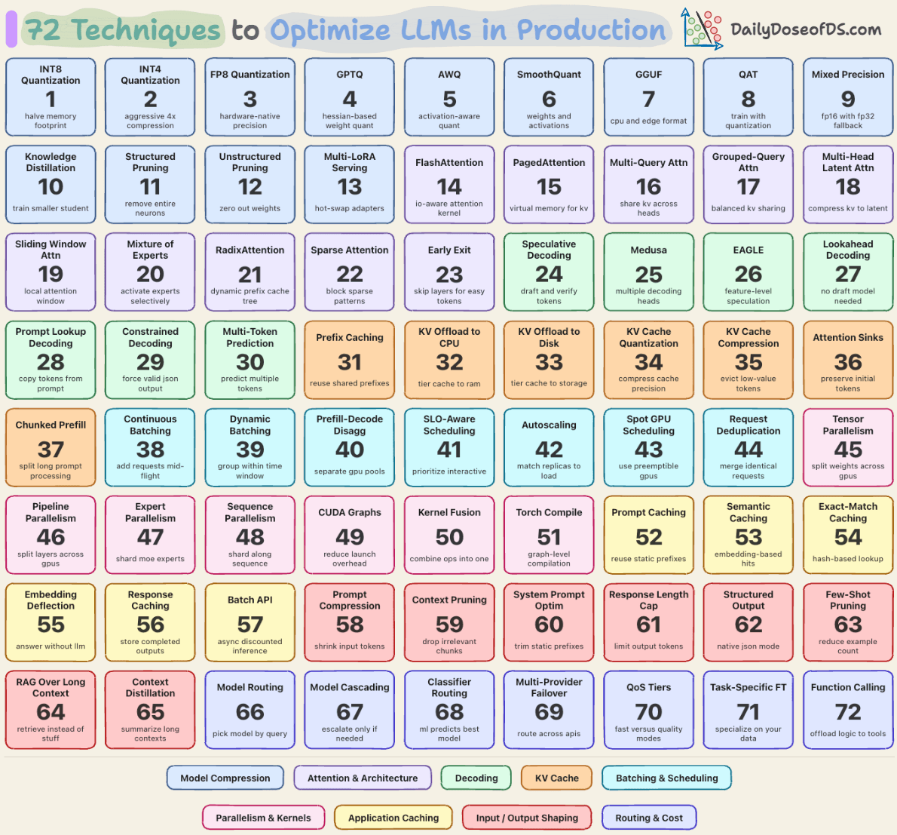

# 72 Techniques to Optimize LLMs in Production

**Type**: LLM Optimization / Production Serving

Comprehensive guide explaining 72 techniques to optimize LLMs in production, organized into 9 categories.

## 9 Categories Overview

| Category | Techniques |
|----------|-----------|
| 1. Model Compression | INT4, INT8, FP8, GPTQ, AWQ, SmoothQuant, Distillation, Pruning |
| 2. Attention & Architecture | FlashAttention, PagedAttention, GQA, MQA, MLA, Sliding Window, MoE, Early Exit |
| 3. Decoding | Speculative Decoding, Medusa, EAGLE, Lookahead, Prompt Lookup, Constrained Decoding, Multi-token Prediction |
| 4. KV Cache | Prefix Caching, KV Offload, KV Quantization, H2O, SnapKV, Attention Sinks, Chunked Prefill |
| 5. Batching & Scheduling | Continuous Batching, Dynamic Batching, Prefill-Decode Disaggregation, SLO-aware, Spot GPU |
| 6. Parallelism & Kernels | Tensor Parallelism, Pipeline Parallelism, CUDA Graphs, Kernel Fusion, Torch Compile |
| 7. Application Caching | Prompt Caching, Semantic Caching, Exact-match Caching |
| 8. Input/Output Shaping | Prompt Compression, Context Pruning, Response Length Caps, Few-shot Pruning |
| 9. Routing & Cost | Model Routing, Model Cascading, Classifier Routing, QoS Tiers |

## Key Insights

1. **No single optimization matters** - Stack techniques layered on each other
2. **5-8x cost gap** between naive FP16 deployment and optimized vLLM/TensorRT-LLM
3. **Work shifted** from model compression to serving optimization

## Production Stack Example

A reasonable setup might use:
- FP8 weights
- GQA-based attention with FlashAttention kernels
- PagedAttention for KV cache
- Continuous batching with prefill-decode disaggregation
- Prefix caching for system prompts
- Semantic caching at application layer
- Prompt compression for long retrieved contexts
- Model routing for trivial queries

---

## Sources

- Article: https://blog.dailydoseofds.com/p/72-techniques-to-optimize-llms-in
- Author: Avi Chawla (Daily Dose of Data Science)
- Date: April 17, 2026

## Related Links

- [Building AI Applications](../topics/Building_AI_applications.md)