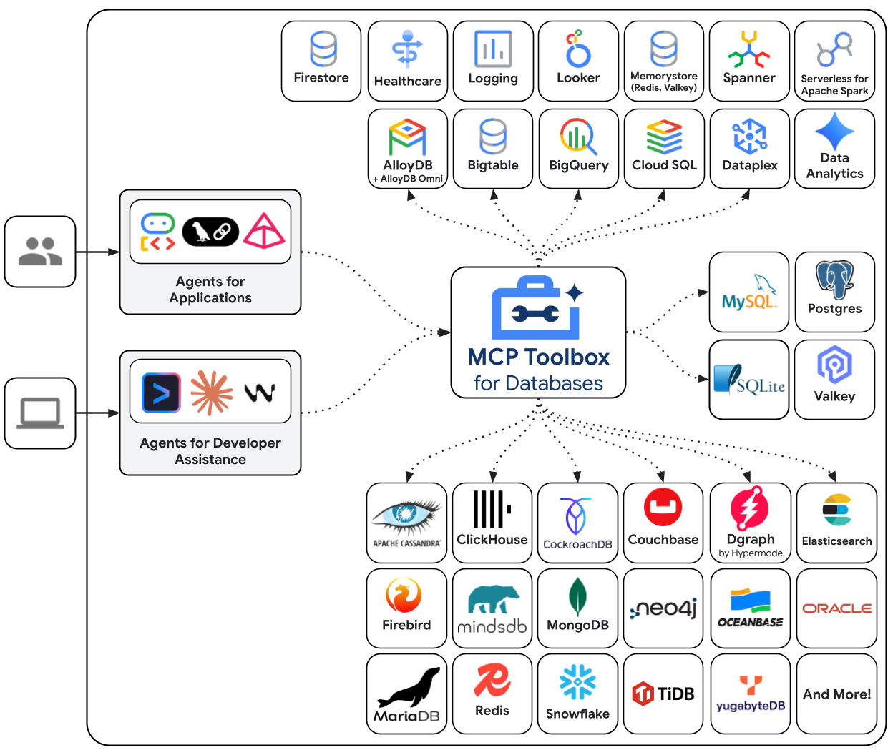

# MCP Toolbox for Databases

- **Source:** [github.com/googleapis/mcp-toolbox](https://github.com/googleapis/mcp-toolbox)
- **Author:** Google (googleapis)
- **Stars:** 15.2k | **License:** Apache-2.0 | **Language:** Go

---

Open-source MCP server that connects AI agents, IDEs, and applications directly to enterprise databases. Dual-purpose: ready-to-use MCP server with prebuilt tools + custom tools framework.

## Prebuilt Tools

Run with `--prebuilt=<database>` to instantly get standard tools (`list_tables`, `execute_sql`, etc.) for:

- **Google Cloud:** AlloyDB, BigQuery, Cloud SQL (PostgreSQL, MySQL, SQL Server), Spanner, Firestore, Knowledge Catalog
- **Others:** PostgreSQL, MySQL, SQL Server, Oracle, MongoDB, Redis, Elasticsearch, CockroachDB, ClickHouse, Couchbase, Neo4j, Snowflake, Trino

## Custom Tools Framework

Configure via `tools.yaml` with:
- **Sources** — data source definitions (host, port, credentials)
- **Tools** — SQL statements with typed parameters
- **Toolsets** — grouped tools for different agents
- **Prompts** — reusable prompt templates

## SDKs & Integrations

- **Python SDK:** Core, LangChain, LlamaIndex
- **JS/TS SDK:** Core, LangChain, Genkit, ADK
- **Go SDK:** Core, LangChain, Genkit, Go GenAI, OpenAI Go, ADK
- **Java SDK** available
- **Agent Skills** generation (agentskills.io spec)
- **Gemini CLI** extensions

## Nguồn

- [Raw Source](../../raw/mcp_toolbox_20260514.md)

## Liên kết liên quan

- [Mirage](./mirage.md) — Unified Virtual Filesystem for AI Agents
- [BlueRock](./bluerock.md) — MCP security sensor
- [Building Agent Apps](../topics/building_agent_apps.md) — Agent application engineering
