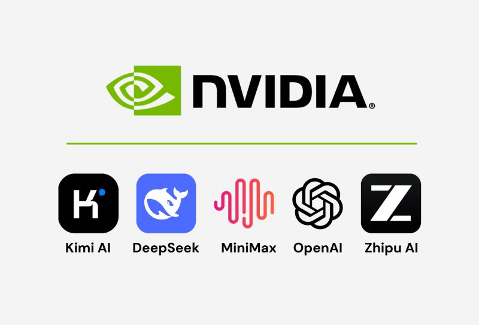

# Free NVIDIA APIs for Open Source Models

- **Provider**: NVIDIA  
- **Access**: https://build.nvidia.com/models



## Overview

NVIDIA is providing free access to 70+ AI models via hosted APIs. You get access to models like MiniMax, GLM, Kimi, DeepSeek, GPT-OSS and others.

## Available Models (70+)

- MiniMax models
- GLM models
- Kimi models
- DeepSeek models
- GPT-OSS models
- And more...

## Integration

Works with tools like:

- Cursor
- Zed
- OpenClaw
- Hermes
- Common agent frameworks

## Setup

1. Generate a key at https://build.nvidia.com/models
2. Point your base_url to `https://integrate.api.nvidia.com/v1`
3. Add your API key and select a model (e.g. `minimaxai/minimax-m2.7`)

```python
# Example configuration
client = OpenAI(
    api_key="your-nvidia-api-key",
    base_url="https://integrate.api.nvidia.com/v1"
)
```

## Technical Details

- **Interface**: OpenAI-compatible API
- **SDK support**: Most SDKs and wrappers work with minimal changes
- **Free tier**: Usage limits apply

## Use Cases

- Prototyping
- Internal tools
- Testing different models
- Building and experimenting without GPU/inference costs

---

## Related Topics

- [AI Landscape](../topics/ai_landscape.md)
- [Foundation Models](../topics/foundation_models.md)

---

## Source

- [Raw Source](../../raw/nvidia_free_apis.md)
- [Website](https://build.nvidia.com/models)