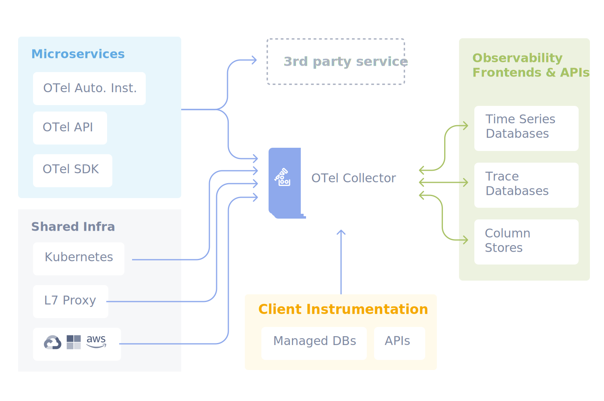

# OpenTelemetry

**Website**: https://opentelemetry.io/
**GitHub**: https://github.com/open-telemetry

## Overview

OpenTelemetry (OTel) is a vendor-neutral open source Observability framework for instrumenting, generating, collecting, and exporting telemetry data such as traces, metrics, and logs.

Supported by more than 90 observability vendors.

## Key Concepts

| Component | Description |
|-----------|-------------|
| **Traces** | Track requests through distributed systems |
| **Metrics** | Numerical measurements of system behavior |
| **Logs** | Timestamp records of events |

## Components

- **API**: Specifications for instrumentation
- **SDK**: Implementations of the API
- **Collectors**: Middleware for processing telemetry
- **Exporters**: Connectors to observability backends

## Related Topics

- [AI Observability](../topics/ai_observability.md)

---

## Source

- [Raw Source](../../raw/opentelemetry.md)
- [Website](https://opentelemetry.io/)