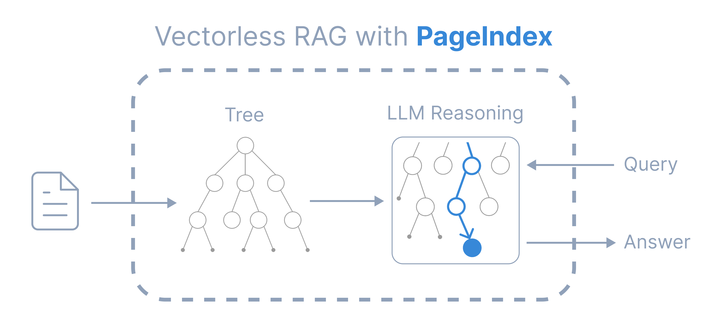
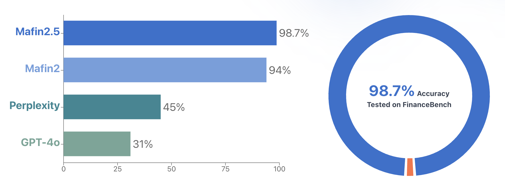

# PageIndex

Vectorless, reasoning-based RAG system that builds hierarchical tree indexes from long documents and uses LLMs to reason over that index for agentic, context-aware retrieval. Achieved 98.7% accuracy on FinanceBench benchmark.

- **GitHub**: [VectifyAI/PageIndex](https://github.com/VectifyAI/PageIndex)  
- **Homepage**: [vectify.ai/pageindex](https://vectify.ai/pageindex)  
- **Chat Platform**: [chat.pageindex.ai](https://chat.pageindex.ai)  
- **Developer**: [pageindex.ai/developer](https://pageindex.ai/developer) (MCP + API)


## Overview

Traditional vector-based RAG relies on semantic **similarity** rather than true **relevance**. PageIndex solves this by using **reasoning-based retrieval** — it simulates how human experts navigate complex documents through tree search.

**Similarity ≠ Relevance**. What we truly need in retrieval is **relevance**, and that requires **reasoning**.



## How PageIndex Works

PageIndex performs retrieval in two steps:

1. **Generate a "Table-of-Contents" tree structure** from documents
2. **Perform reasoning-based retrieval** through tree search using LLMs

No vector database. No chunking. Human-like retrieval with traceable, interpretable results.

## Core Features

- **No Vector DB** — Uses document structure and LLM reasoning instead of vector similarity search
- **No Chunking** — Documents organized into natural sections, not artificial chunks
- **Human-like Retrieval** — Simulates how human experts navigate complex documents
- **Better Explainability** — Traceable and interpretable retrieval with page and section references
- **State-of-the-Art Accuracy** — 98.7% on FinanceBench, outperforming vector RAG

## Package Usage

### 1. Install Dependencies

```bash
pip install --upgrade -r requirements.txt
```

### 2. Set LLM API Key

Create `.env` file (supports multiple LLMs via LiteLLM):

```
OPENAI_API_KEY=your_openai_key_here
```

### 3. Generate PageIndex Tree

```bash
python run_pageindex.py --pdf_path /path/to/document.pdf
```

**Optional parameters:**
- `--model`: LLM model (default: gpt-4o-2024-11-20)
- `--toc-check-pages`: Pages to check for table of contents (default: 20)
- `--max-pages-per-node`: Max pages per node (default: 10)
- `--max-tokens-per-node`: Max tokens per node (default: 20000)

### Markdown Support

```bash
python run_pageindex.py --md_path /path/to/document.md
```

## Agentic Vectorless RAG

End-to-end agentic RAG example using PageIndex with OpenAI Agents SDK:

```bash
pip install openai-agents
python examples/agentic_vectorless_rag_demo.py
```

## Vision-based Vectorless RAG

OCR-free, vision-only RAG that works directly over PDF page images — no traditional OCR needed.

## Deployment Options

| Option | Description |
|---|---|
| **Self-host** | Run locally with this open-source repo (standard PDF parsing) |
| **Cloud Service** | Production-grade pipeline with enhanced OCR, tree building, best results |
| **Enterprise** | Private or on-prem deployment |

## Case Study: Finance QA Benchmark

Mafin 2.5 is a reasoning-based RAG system for financial document analysis, powered by **PageIndex**. Achieved **98.7% accuracy** on FinanceBench, outperforming traditional vector RAG systems.



## Resources

- [Blog](https://pageindex.ai/blog) — Technical articles and research insights
- [Cookbooks](https://docs.pageindex.ai/cookbook) — Hands-on, runnable examples
- [Tutorials](https://docs.pageindex.ai/tutorials) — Document search, tree search strategies
- [MCP Server](https://pageindex.ai/developer) — Integrate via Model Context Protocol
- [API Docs](https://pageindex.ai/developer) — REST API for production use

## Nguồn

- [PageIndex Raw Source](../../raw/pageindex_20260505.md)
- [GitHub Repository](https://github.com/VectifyAI/PageIndex)

## Liên kết liên quan

- [Data Processing](../topics/Data_processing.md) - Topic covering data processing tools
- [RAG Applications](../topics/rag_applications.md) - Topic covering RAG use cases (NEW)
- [Proxy-Pointer RAG](../sources/proxy_pointer_rag.md) - Vectorless accuracy at vector RAG scale
