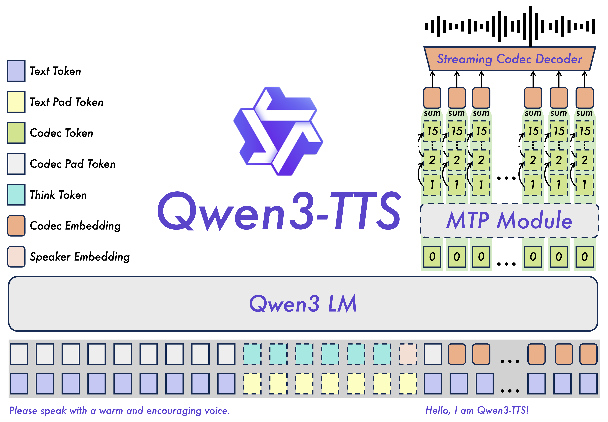

# Qwen3-TTS

Open-source TTS model series from Qwen (Alibaba Cloud) supporting voice clone, voice design, streaming speech generation, and natural language voice control across 10 languages.

- **GitHub**: [QwenLM/Qwen3-TTS](https://github.com/QwenLM/Qwen3-TTS) (11.1k stars)  
- **License**: Apache-2.0  
- **Paper**: [arXiv:2601.15621](https://arxiv.org/abs/2601.15621)  
- **Hugging Face**: [Qwen/qwen3-tts](https://huggingface.co/collections/Qwen/qwen3-tts)

## Overview

Qwen3-TTS is a series of text-to-speech models (0.6B and 1.7B) built on the Qwen3-TTS-Tokenizer-12Hz, offering comprehensive speech generation capabilities including voice cloning, voice design, and instruction-controlled synthesis across 10 languages.


## Key Features

### Powerful Speech Representation
- **Qwen3-TTS-Tokenizer-12Hz**: Custom speech tokenizer for efficient acoustic compression and high-dimensional semantic modeling
- Preserves paralinguistic information and acoustic environment features
- Lightweight non-DiT architecture for high-fidelity reconstruction

### Universal End-to-End Architecture
- Discrete multi-codebook LM architecture for full-information speech modeling
- Eliminates information bottlenecks and cascading errors of traditional LM+DiT schemes

### Extreme Low-Latency Streaming
- **Dual-Track hybrid streaming**: Single model supports both streaming and non-streaming
- First audio packet output after single character input
- End-to-end latency as low as **97ms**

### Intelligent Voice Control
- Natural language instruction-driven speech generation
- Adaptive control over timbre, emotion, prosody based on text semantics
- "What you imagine is what you hear" output quality

## Model Architecture



## Released Models

| Model | Size | Features | Streaming | Instruction |
|---|---|---|---|---|
| Qwen3-TTS-12Hz-1.7B-VoiceDesign | 1.7B | Voice design from text descriptions | ✅ | ✅ |
| Qwen3-TTS-12Hz-1.7B-CustomVoice | 1.7B | Style control; 9 premium timbres | ✅ | ✅ |
| Qwen3-TTS-12Hz-1.7B-Base | 1.7B | 3-second voice clone; FT base | ✅ | |
| Qwen3-TTS-12Hz-0.6B-CustomVoice | 0.6B | 9 premium timbres | ✅ | |
| Qwen3-TTS-12Hz-0.6B-Base | 0.6B | 3-second voice clone; FT base | ✅ | |

## Supported Speakers

| Speaker | Description | Native Language |
|---|---|---|
| Vivian | Bright, slightly edgy young female voice | Chinese |
| Serena | Warm, gentle young female voice | Chinese |
| Uncle_Fu | Seasoned male voice, low mellow timbre | Chinese |
| Dylan | Youthful Beijing male voice | Chinese (Beijing Dialect) |
| Eric | Lively Chengdu male voice | Chinese (Sichuan Dialect) |
| Ryan | Dynamic male voice, strong rhythmic drive | English |
| Aiden | Sunny American male voice, clear midrange | English |
| Ono_Anna | Playful Japanese female voice | Japanese |
| Sohee | Warm Korean female voice, rich emotion | Korean |

## Supported Languages

Chinese, English, Japanese, Korean, German, French, Russian, Portuguese, Spanish, Italian (+ dialectal variants)

## Quickstart

```bash
pip install -U qwen-tts
```

```python
from qwen_tts import Qwen3TTSModel

model = Qwen3TTSModel.from_pretrained(
    "Qwen/Qwen3-TTS-12Hz-1.7B-CustomVoice",
    device_map="cuda:0",
    dtype=torch.bfloat16,
)

wavs, sr = model.generate_custom_voice(
    text="Hello world",
    language="English",
    speaker="Ryan",
    instruct="Very happy.",  # optional
)
```

## Evaluation Highlights

- **Seed-TTS**: WER 0.77 (zh), 1.24 (en) — SOTA among open models
- **Cross-lingual**: Significantly outperforms CosyVoice2 on zh↔en↔ja↔ko tasks
- **Voice Design**: Best APS scores (85.2 ZH, 82.4 EN) on InstructTTSEval
- **Multilingual**: Lower WER than MiniMax and ElevenLabs on most languages

## Deployment

- **Python Package**: `pip install -U qwen-tts`
- **Web UI**: `qwen-tts-demo <model> --ip 0.0.0.0 --port 8000`
- **vLLM**: Day-0 support via vLLM-Omni (offline inference)
- **API**: DashScope real-time API available

## Nguồn

- [Qwen3-TTS Raw Source](../../raw/qwen3_tts_20260122.md)
- [GitHub Repository](https://github.com/QwenLM/Qwen3-TTS)
- [Paper](https://arxiv.org/abs/2601.15621)

## Liên kết liên quan

- [Audio Models](../topics/audio_models.md) - Topic covering audio/speech models
- [Foundation Models](../topics/foundation_models.md) - Overview of foundation models
- [Qwen](../entities/qwen.md) - Qwen team at Alibaba Cloud
