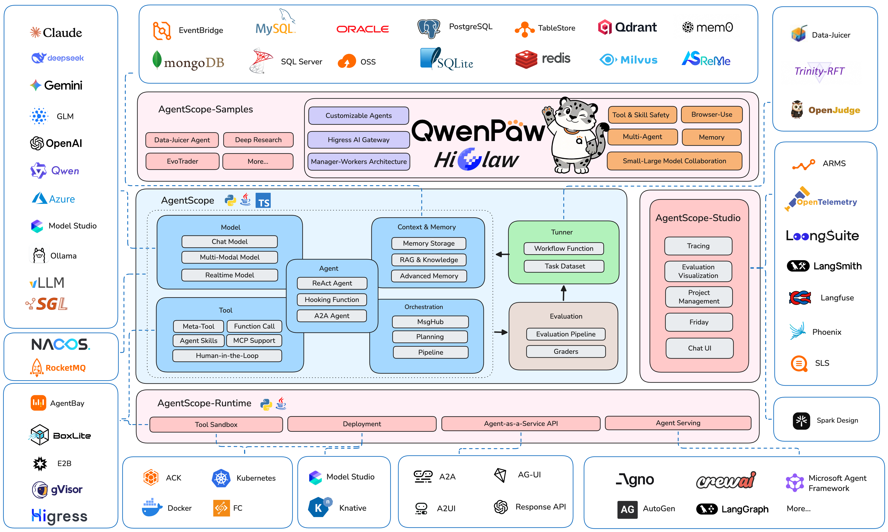

# QwenPaw

- **Type**: Personal AI Assistant  
- **Slogan**: Works for you, grows with you.



Personal AI assistant — easy to install, deploy locally or in the cloud, connect across channels, extend with skills. Built by AgentScope team (formerly known as CoPaw, rebranded in April 2026).

## Details

- **Org**: agentscope-ai (ModelScope)
- **License**: Apache 2.0
- **GitHub**: [https://github.com/agentscope-ai/QwenPaw](https://github.com/agentscope-ai/QwenPaw)
- **Stars**: 16.4k+ (and growing)
- **Documentation**: [https://qwenpaw.agentscope.io/](https://qwenpaw.agentscope.io/)

## Key Features

- **Under Your Control** — Memory and personalization fully under your control. Deploy locally (data stays on your machine) or in the cloud. No third-party hosting, no data upload.
- **Skills Extension** — Built-in scheduling, PDF/Office processing, news digest; custom skills auto-loaded, no lock-in. Skills determine what QwenPaw can do.
- **Multi-Agent Collaboration** — Create multiple independent agents, each with their own role; enable collaboration skills for inter-agent communication.
- **Multi-Layer Security** — Tool guard, file access control, skill security scanning to ensure safe operation.
- **Every Channel** — DingTalk, Feishu, WeChat, Discord, Telegram, and more. One QwenPaw, connect as needed.
- **Memory-Evolving & Proactive** — Agent learns from interactions, reflects on experience, and proactively serves you. Gets smarter the more you use it.
- **Local Models** — Supports llama.cpp, Ollama, LM Studio (no API key needed).

## What You Can Do

- **Social media**: Daily hot post digests (Xiaohongshu, Zhihu, Reddit), Bilibili/YouTube video summaries
- **Productivity**: Email & newsletter highlights pushed to DingTalk/Feishu/QQ; email & calendar contact organization
- **Creative & building**: Describe your goal before sleep, auto-execute, wake up to a prototype; full workflow from topic selection to final video
- **Research & learning**: Track tech & AI news, personal knowledge base search and reuse
- **Desktop & files**: Organize and search local files, read & summarize documents, request files in chat
- **Combine Skills**: Combine Skills with scheduled tasks into your own agentic app

## Installation

### Option 1: pip install

```bash
pip install qwenpaw
qwenpaw init --defaults
qwenpaw app
```

Then open **[http://127.0.0.1:8088/](http://127.0.0.1:8088/)** for the Console.

### Option 2: Script install (macOS/Linux)

```bash
curl -fsSL https://qwenpaw.agentscope.io/install.sh | bash
```

### Option 3: Docker

```bash
docker pull agentscope/qwenpaw:latest
docker run -p 127.0.0.1:8088:8088 \
  -v qwenpaw-data:/app/working \
  agentscope/qwenpaw:latest
```

### Option 4: Desktop Application (Beta)

Download from [GitHub Releases](https://github.com/agentscope-ai/QwenPaw/releases):
- **Windows**: `QwenPaw-Setup-<version>.exe`
- **macOS**: `QwenPaw-<version>-macOS.zip` (Apple Silicon recommended)

### Option 5: ModelScope Studio

No local install? Use [ModelScope Studio](https://modelscope.cn/studios/fork?target=AgentScope/QwenPaw) for one-click cloud setup.

## Security Features

- **Tool guard** — Intercepts dangerous shell commands (e.g., `rm -rf /`, fork bombs, reverse shells)
- **File access guard** — Restricts agent access to sensitive paths (`~/.ssh`, key files, system directories)
- **Skill security scanning** — Detects prompt injection, command injection, hardcoded keys, data exfiltration
- **Local deployment** — All data and memory stored locally, no third-party upload
- **Web Authentication** — Optional login protection for the Console (set `QWENPAW_AUTH_ENABLED=true`)

## CLI Commands

```bash
qwenpaw init --defaults     # Initialize with defaults
qwenpaw app                 # Start web UI
qwenpaw doctor               # Diagnostic command
qwenpaw agents create       # CLI agent creation
qwenpaw uninstall           # Keeps config and data
qwenpaw uninstall --purge   # Removes everything
```

## Recent Updates (v1.1.5 - 2026-04-29)

- Memory search optimization; context compaction fallback
- ACP agent rename & delete; QQ voice & ASR support
- Config and skill manifest loading cache; model API request deduplication
- Channel approval commands; timezone normalization; MCP execution timeout handling

## Rebranding Notice

In April 2026, **CoPaw** officially rebranded to **QwenPaw**:
- *Qwen* — represents deeper integration with the Qwen open-source ecosystem and focus on the model layer
- *Paw* — carries forward the original mission to accompany users as a trusted personal assistant

---

## Source

- [Raw Source](../../raw/qwenpaw.md)
- [GitHub Repository](https://github.com/agentscope-ai/QwenPaw)
- [Official Documentation](https://qwenpaw.agentscope.io/)
- [Release Notes](https://qwenpaw.agentscope.io/release-notes)

## Related Topics

- [Personal Agents](../topics/personal_agent.md)
- [AgentScope Framework](../sources/agentscope.md) - Multi-agent framework that includes QwenPaw

## Related Entities

- [AgentScope Team](../entities/agentscope_team.md)

## Community

- [Discord](https://discord.gg/eYMpfnkG8h)
- [X (Twitter)](https://x.com/agentscope_ai)
- [DingTalk](https://qr.dingtalk.com/action/joingroup?code=v1,k1,OmDlBXpjW+I2vWjKDsjvI9dhcXjGZi3bQiojOq3dlDw=&_dt_no_comment=1&origin=11)
- [RedNote](https://www.xiaohongshu.com/user/profile/691c18db0000000037032be9)
