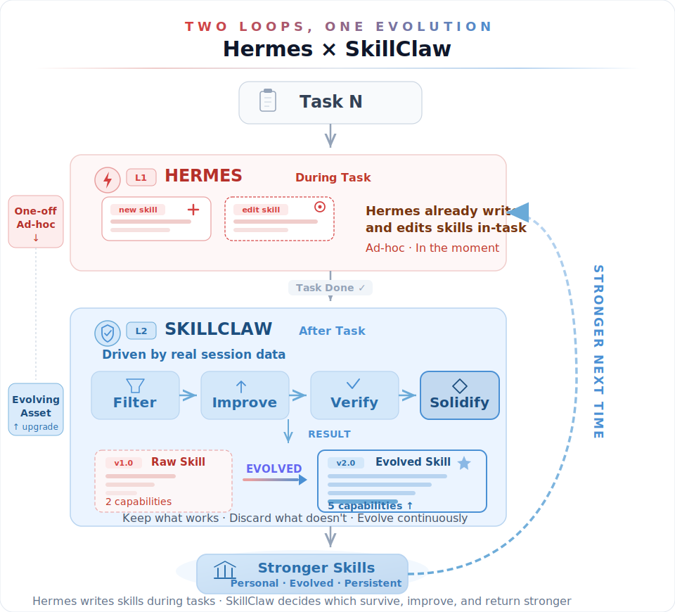

# SkillClaw

- **Type**: Skill Evolution System

Let Skills Evolve Collectively with Agentic Evolver.

[GitHub](https://github.com/AMAP-ML/SkillClaw) | [Paper](https://arxiv.org/abs/2604.08377)

## Overview

SkillClaw makes LLM agents progressively better by **evolving reusable skills** from real session data. Skills are automatically deduplicated, improved, and verified across sessions. Scale up for multiple agents, devices, or team sharing.

## Details

- **Org**: AMAP-ML
- **Stars**: 741
- **Forks**: 78
- **License**: MIT
- **Language**: Python (98.9%), Shell (1.1%)

## Architecture



## Key Features

- **Collective Skill Evolution** - Skills evolve from every session, every agent, every context
- **Auto-evolve, auto-deduplicate, auto-improve** - Makes everything learned actually count
- **Multiple agents** - One unified skill library, skills merge and cross-pollinate
- **Multiple devices** - Skills follow you, not your machine
- **Team sharing** - N users, one skill, continuous evolution
- **Hermes integration** - Native seamless integration
- **Broad compatibility** - Works with Hermes, OpenClaw, QwenPaw, IronClaw, PicoClaw, ZeroClaw, NanoClaw, NemoClaw

## Architecture

### 1. Client Proxy
Local API proxy (`/v1/chat/completions`, `/v1/messages`) that:
- Intercepts agent requests
- Records session artifacts
- Manages local skill library

### 2. Evolve Server (Optional)
Service for automatic evolution or team sharing. Two engines:
- **`workflow`**: Fixed 3-stage LLM pipeline (Summarize → Aggregate → Execute)
- **`agent`**: OpenClaw-driven agent workspace with direct skill editing

Both share the same storage layer (local, OSS, S3) and skill format (`SKILL.md`).

## Deployment Models

| Model | Setup |
|-------|-------|
| Single user | Client proxy only |
| Single user + auto-evolve | Client + evolve server on same machine |
| Team | Multiple clients + shared storage + one evolve server |

## Quick Start

```bash
# Install
git clone https://github.com/AMAP-ML/SkillClaw.git && cd SkillClaw
bash scripts/install_skillclaw.sh
source .venv/bin/activate

# Setup
skillclaw setup

# Start
skillclaw start --daemon
```

## Related Projects

- [MetaClaw](https://github.com/aiming-lab/MetaClaw) - Just talk to your agent — it learns and evolves
- [Hermes Agent](../sources/hermes_agent.md) - Integration target
- [OpenClaw](https://github.com/openclaw/openclaw) - Agent platform

---

## Nguồn

- [GitHub Repository](https://github.com/AMAP-ML/SkillClaw)
- [Paper (arXiv)](https://arxiv.org/abs/2604.08377)
- [../../raw/skillclaw.md](../../raw/skillclaw.md)

## Liên kết liên quan

- [Agent Skills](../topics/agent_skills.md)