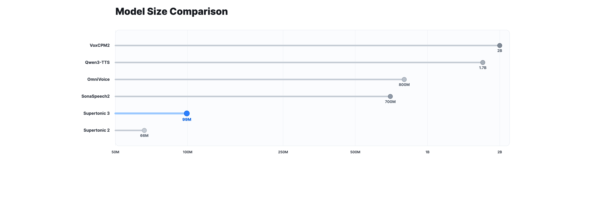

# Supertonic — Lightning Fast, On-Device, Multilingual TTS

- **Organization**: Supertone Inc.
- **Stars**: 7.7k
- **License**: MIT (code) / OpenRAIL-M (model)

Supertonic is a lightning-fast, on-device multilingual text-to-speech system designed for local inference with minimal overhead. Powered by ONNX Runtime, it runs entirely on your device with no cloud dependency.

## Key Features

- **Blazingly Fast** — Low-latency, real-time synthesis across desktop, browser, mobile, and edge
- **31-Language Multilingual** — Direct synthesis from text across 31 languages, or language-agnostic mode
- **99M-Parameter Open-Weight Model** — Compact checkpoint, fraction of 0.7B–2B class TTS systems
- **Edge-Device Ready** — Runs on desktop, mobile, browsers, Raspberry Pi, e-readers, zero network dependency
- **44.1kHz High-Quality Audio** — Studio-grade output directly, no external upsampler needed
- **Expression Tags** — 10 inline tags (`<laugh>`, `<breath>`, `<sigh>`) for natural nuance
- **Multi-Runtime SDKs** — Python, Node.js, Browser (WebGPU), Java, C++, C#, Go, Swift, iOS, Rust, Flutter

## Performance

- **Reading Accuracy**: Competitive WER/CER on Minimax-MLS-test benchmark against VoxCPM2, OmniVoice, Qwen3-TTS
- **Runtime**: Runs fast on CPU with substantially less memory than GPU-dependent baselines
- **Model Size**: ~99M parameters, significantly smaller than 0.7B–2B class open TTS systems

## Architecture

- **Runtime**: ONNX Runtime for cross-platform inference
- **Browser Support**: onnxruntime-web for client-side WebGPU/WASM inference
- **Batch Processing**: Supports batch inference for improved throughput
- **Audio Output**: 44.1kHz 16-bit WAV

## Voice Builder

Turn your voice into a deployable, edge-native TTS with permanent ownership. Upload reference audio and get a custom voice style that runs locally.

## Ecosystem

- **Built-in apps**: TLDRL (Chrome TTS extension), Read Aloud, PageEcho (iOS e-book reader)
- **Community projects**: VoiceChat (on-device voice-to-voice LLM), OmniAvatar (talking avatar), CopiloTTS (Kotlin Multiplatform TTS SDK)
- **Integrations**: Transformers.js, Pinokio, Supertonic MNN

## Source

- [Raw Source](../../raw/supertonic_20260518.md)
- [GitHub](https://github.com/supertone-inc/supertonic)
- [Hugging Face Models](https://huggingface.co/Supertone/supertonic-3)
- [Interactive Demo](https://huggingface.co/spaces/Supertone/supertonic-3)
- [Voice Builder](https://supertonic.supertone.ai/voice_builder)
- [Documentation (Python PyPI)](https://supertone-inc.github.io/supertonic-py/)
