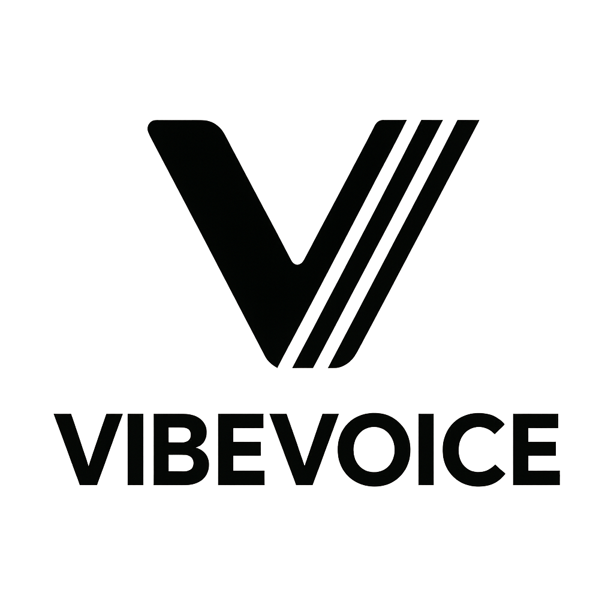
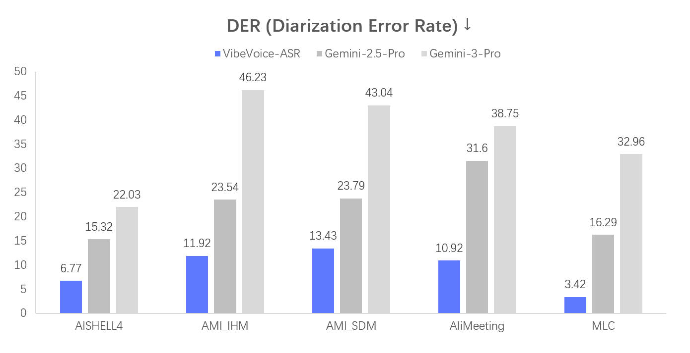
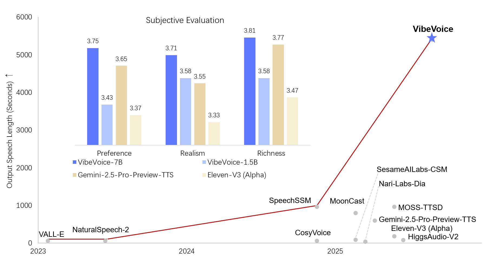

# VibeVoice

Open-source frontier voice AI family from Microsoft — includes TTS (long-form multi-speaker, real-time streaming) and ASR (60-minute single-pass) models built on continuous speech tokenizers at 7.5 Hz and next-token diffusion.

**GitHub**: [microsoft/VibeVoice](https://github.com/microsoft/VibeVoice)  
**Project Page**: [microsoft.github.io/VibeVoice](https://microsoft.github.io/VibeVoice)  
**Hugging Face**: [microsoft/vibevoice](https://huggingface.co/collections/microsoft/vibevoice-68a2ef24a875c44be47b034f)  
**Paper (TTS)**: [ICLR 2026 Oral](https://arxiv.org/pdf/2508.19205)  
**Paper (ASR)**: [arXiv:2601.18184](https://arxiv.org/pdf/2601.18184)

## Overview

VibeVoice is a family of voice AI models from Microsoft covering both text-to-speech (TTS) and automatic speech recognition (ASR). Its core innovation is the use of **continuous speech tokenizers** (Acoustic and Semantic) at an ultra-low frame rate of **7.5 Hz**, which preserves audio fidelity while dramatically boosting efficiency for long sequences.

The architecture uses a [next-token diffusion](https://arxiv.org/abs/2412.08635) framework: an LLM understands textual context and dialogue flow, while a diffusion head generates high-fidelity acoustic details.

## Models

### VibeVoice-ASR-7B — Long-form Speech Recognition

Handles **60 minutes of continuous audio** in a single pass (64K token length), producing structured transcriptions with Who (Speaker), When (Timestamps), and What (Content).

**Key Features:**
- **60-minute single-pass**: No chunking, maintains global context and consistent speaker tracking
- **Customized Hotwords**: Guide recognition with domain-specific terms
- **Rich Transcription**: Joint ASR + diarization + timestamping
- **50+ languages** supported
- Finetuning code and vLLM inference available
- Now integrated into Hugging Face Transformers library

**Evaluation Results:**

[Playground](https://aka.ms/vibevoice-asr) | [HF Model](https://huggingface.co/microsoft/VibeVoice-ASR)

### VibeVoice-TTS-1.5B — Long-form Multi-speaker TTS (ICLR 2026 Oral)

Synthesizes up to **90 minutes** of conversational audio in a single pass with up to **4 distinct speakers**.

**Key Features:**
- **90-minute generation**: Single pass, consistent speaker identity
- **Multi-speaker**: Up to 4 speakers, natural turn-taking
- **Expressive speech**: Conversational dynamics, emotional nuances
- **Multi-lingual**: English, Chinese, and more
- Supports spontaneous singing

⚠️ TTS code was removed from the repo in Sept 2025 due to misuse. Model weights remain available on Hugging Face.

[HF Model](https://huggingface.co/microsoft/VibeVoice-1.5B) | [Paper](https://arxiv.org/pdf/2508.19205)

### VibeVoice-Realtime-0.5B — Real-time Streaming TTS

Lightweight deployment-friendly model for real-time applications.

**Key Features:**
- **0.5B parameters**: Small enough for deployment
- **~300ms first audible latency**: Real-time streaming
- **Streaming text input**: Incremental text processing
- **~10 minutes long-form**: Robust extended generation
- **Experimental speakers**: 9 languages (DE, FR, IT, JP, KR, NL, PL, PT, ES), 11 English style voices

[Colab](https://colab.research.google.com/github/microsoft/VibeVoice/blob/main/demo/vibevoice_realtime_colab.ipynb) | [HF Model](https://huggingface.co/microsoft/VibeVoice-Realtime-0.5B)

## Architecture

| Component | Description |
|---|---|
| Speech Tokenizers | Continuous (Acoustic + Semantic) at 7.5 Hz |
| Language Model | Qwen2.5 1.5B base |
| Generation | Next-token diffusion framework |
| Acoustic Detail | Diffusion head |

## Comparison with Other TTS

VibeVoice TTS excels at long-form generation (90 min single pass) and multi-speaker scenarios (up to 4 speakers), differentiating from shorter-horizon models like Qwen3-TTS.

## Nguồn

- [VibeVoice Raw Source](../../raw/vibevoice_20260504.md)
- [GitHub Repository](https://github.com/microsoft/VibeVoice)
- [Project Page](https://microsoft.github.io/VibeVoice)

## Liên kết liên quan

- [Audio Models](../topics/audio_models.md) - TTS and speech models topic
- [Qwen3-TTS](../sources/qwen3_tts.md) - Another TTS model in the wiki
- [Voicebox](../sources/voicebox.md) - Voice studio that could integrate VibeVoice
