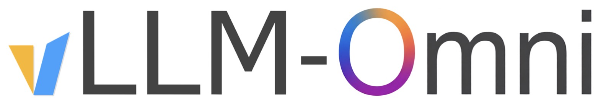

# vLLM-Omni

- **Type**: Omni-Modality Model Inference & Serving Framework



Framework for efficient model inference with omni-modality models. Extends vLLM to support text, image, video, and audio data processing, including non-autoregressive architectures (Diffusion Transformers) and heterogeneous outputs.

## Details

- **Org**: vllm-project
- **License**: Apache-2.0
- **GitHub**: [https://github.com/vllm-project/vllm-omni](https://github.com/vllm-project/vllm-omni)
- **Stars**: 4.7k+
- **Documentation**: [https://vllm-omni.readthedocs.io/](https://vllm-omni.readthedocs.io/en/latest/)
- **Paper**: [https://arxiv.org/abs/2602.02204](https://arxiv.org/abs/2602.02204)
- **Latest Release**: v0.20.0 (2026-05-07)

## Key Features

- **Omni-modality Serving** — Text, image, video, and audio processing in a single framework
- **Non-autoregressive Support** — Extends vLLM to Diffusion Transformers (DiT) and parallel generation models
- **Pipelined Stage Execution** — High throughput through overlapping stages
- **Fully Disaggregated** — OmniConnector with dynamic resource allocation across stages
- **Distributed Inference** — Tensor, pipeline, data, and expert parallelism
- **OpenAI-Compatible API** — Streaming outputs, easy integration
- **HuggingFace Integration** — Seamless support for popular open-source models

## Supported Models

- Omni-modality: Qwen-Omni
- Multi-modality generation: Qwen-Image, Qwen3-TTS
- Diffusion-based: image/video generation models (DiT)
- Audio models: Bagel, MiMo-Audio

## Quick Start

```bash
# See full documentation:
# https://vllm-omni.readthedocs.io/en/latest/getting_started/quickstart/
```

---

## Source

- [Raw Source](../../raw/vllm_omni_20260512.md)
- [GitHub Repository](https://github.com/vllm-project/vllm-omni)
- [Official Documentation](https://vllm-omni.readthedocs.io/en/latest/)

## Related Topics

- [Generative AI and LLM](../topics/llm.md) — Running LLM Model section
- [Audio Models](../topics/audio_models.md)
- [Vision Models](../topics/vision_models.md)
