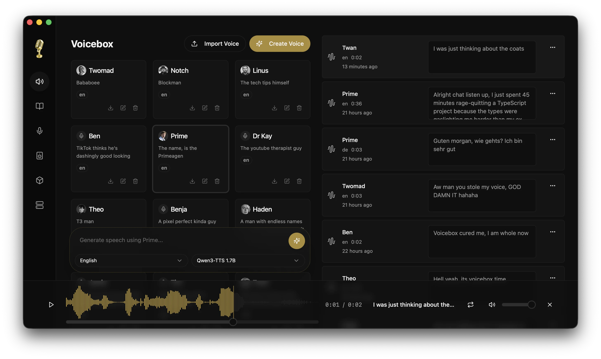

# Voicebox

Open-source local-first AI voice studio — an alternative to ElevenLabs and WisprFlow in one desktop app. Clone voices, generate speech in 23 languages across 7 TTS engines, global dictation, and give MCP-aware AI agents a voice.

**GitHub**: [jamiepine/voicebox](https://github.com/jamiepine/voicebox)  
**Website**: [voicebox.sh](https://voicebox.sh)  
**Docs**: [docs.voicebox.sh](https://docs.voicebox.sh)  
**License**: MIT

## Overview

Voicebox bridges the complete voice I/O loop: ElevenLabs-style output (TTS) + WisprFlow-style input (dictation/STT), with a bundled local LLM for refinement and per-profile personas. Everything runs locally on your machine.



## Key Features

### 7 TTS Engines

| Engine | Languages | Strengths |
|---|---|---|
| **Qwen3-TTS** (0.6B/1.7B) | 10 | Multilingual cloning, delivery instructions |
| **Qwen CustomVoice** | 10 | 9 preset voices, natural-language delivery control |
| **LuxTTS** | English | Lightweight (~1GB VRAM), 150x realtime on CPU |
| **Chatterbox Multilingual** | 23 | Broadest language coverage (Arabic, Hindi, Swahili...) |
| **Chatterbox Turbo** | English | Paralinguistic tags: `[laugh]`, `[sigh]`, `[gasp]` |
| **TADA** (1B/3B) | 10 | HumeAI model, 700s+ coherent audio |
| **Kokoro** | 8 | 50 preset voices, tiny 82M model |

### Voice Personalities

Attach a free-form persona to any voice profile. Two actions powered by bundled local Qwen3 LLM:

- **Compose** — generate fresh in-character lines
- **Speak in character** — rewrite input through personality before TTS

Agents can reach the same path over MCP via `voicebox.speak(personality: true)`.

### Agent Voice Output

One tool call and any MCP-aware agent speaks to you in a cloned voice:

```ts
await voicebox.speak({
  text: "Deploy complete.",
  profile: "Morgan",
});
```

Per-agent voice binding in Settings — pin Claude Code to Morgan, Cursor to Scarlett.

### Global Dictation

- Configurable hotkey (hold-to-speak or tap-to-toggle)
- Target-aware paste on macOS (accessibility-verified)
- LLM refinement (remove ums, stutters, false starts)
- On-screen pill showing recording/transcribing/refining/speaking states

### Stories Editor

Multi-track timeline for conversations, podcasts, narratives with drag-and-drop, inline trimming, and version pinning.

### API & MCP Server

REST API at port 17493 with built-in MCP server:

- `voicebox.speak` — TTS output
- `voicebox.transcribe` — STT
- `voicebox.list_captures` — browse recordings
- `voicebox.list_profiles` — browse voice profiles

```bash
# Claude Code one-liner
claude mcp add voicebox \
  --transport http \
  --url http://127.0.0.1:17493/mcp
```

### Captures

Every dictation, recording, and uploaded audio lands in Captures tab with transcript paired. Replay, re-transcribe, refine, or promote to voice sample.

### Post-Processing Effects

8 effects via Spotify's `pedalboard`: pitch shift, reverb, delay, chorus, compressor, gain, high-pass, low-pass filter. 4 built-in presets (Robotic, Radio, Echo Chamber, Deep Voice).

## Tech Stack

| Layer | Technology |
|---|---|
| Desktop App | Tauri (Rust) |
| Frontend | React, TypeScript, Tailwind CSS |
| Backend | FastAPI (Python) |
| TTS Engines | Qwen3-TTS, LuxTTS, Chatterbox, TADA, Kokoro |
| STT | Whisper / Whisper Turbo |
| Local LLM | Qwen3 (0.6B/1.7B/4B) |
| Inference | MLX (Apple Silicon) / PyTorch (CUDA/ROCm/XPU) |

## Platform Support

| Platform | Backend | Notes |
|---|---|---|
| macOS (Apple Silicon) | MLX (Metal) | 4-5x faster via Neural Engine |
| Windows/Linux (NVIDIA) | PyTorch (CUDA) | Auto-downloads CUDA binary |
| Linux (AMD) | PyTorch (ROCm) | Auto-configures HSA_OVERRIDE_GFX_VERSION |
| Windows (any GPU) | DirectML | Universal Windows GPU support |
| Intel Arc | IPEX/XPU | Intel discrete GPU acceleration |
| Any | CPU | Works everywhere, just slower |

## Roadmap

- Windows/Linux auto-paste (dictation paste parity)
- STT expansion: Parakeet v3, Qwen3-ASR (50+ languages)
- Pipeline routing: configurable source → transform → sink chains
- Streaming transcription (WebSocket)
- End-to-end speech LLMs: Moshi, GLM-4-Voice, Qwen2.5-Omni
- Voice Design: create voices from text descriptions
- Plugin architecture
- Mobile companion app

## Nguồn

- [Voicebox Raw Source](../../raw/voicebox_20260503.md)
- [GitHub Repository](https://github.com/jamiepine/voicebox)
- [Official Website](https://voicebox.sh)

## Liên kết liên quan

- [AI Applications](../topics/ai_applications.md) - Topic covering AI applications
- [Audio Models](../topics/audio_models.md) - TTS and speech models
- [Qwen3-TTS](../sources/qwen3_tts.md) - TTS engine used by Voicebox
- [Builder Agents](../topics/builder_agents.md) - AI coding assistants that can use Voicebox MCP
