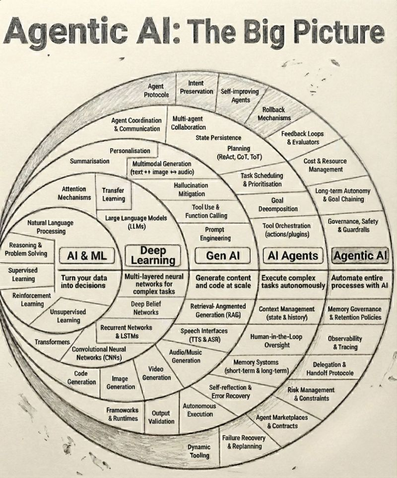

# Agent Applications

Tập hợp các nội dung nói về các ứng dụng Agents và các tools, MCP, và plugins cho các ứng dụng này.

## Agentic AI: The Big Picture 🧠🤖



Most conversations about AI stop at models. But the real shift is happening above them.

### Evolution of AI Layers

```
AI & ML → turning data into predictions
Deep Learning → handling complex patterns
GenAI → generating text, images, code
AI Agents → executing tasks autonomously
Agentic AI → orchestrating entire workflows with memory, goals, and governance
```

### What Makes Agentic AI Different

It's not intelligence alone — it's **agency**:

- **Long-term goals** — AI can maintain and pursue objectives over extended periods
- **Tool orchestration** — coordinating multiple tools and services
- **Memory & context** — maintaining state across sessions
- **Self-reflection and recovery** — monitoring own performance and self-correcting
- **Safety, guardrails, and governance** — built-in controls for responsible operation

### The Shift

> AI isn't just generating content anymore. It's planning, deciding, coordinating, and acting.

### The Big Question

> "How do we deploy it responsibly, securely, and at scale?"

This is where AI stops being a feature and starts becoming a **digital teammate**.

---

## Agent Types

- [Builder Agents](./builder_agents.md) - AI coding assistants
- [Personal Agents](./personal_agent.md) - Personal AI assistants
- [Research Agents](./Research_agents.md) - Research automation