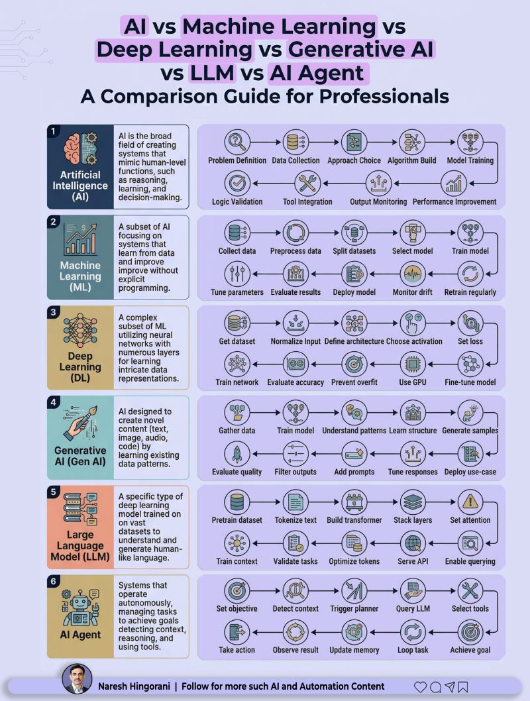

# AI Landscape

Kiến thức nền tảng về AI, Generative AI, LLM models, foundation models.

## AI Hierarchy & Lifecycle



### The Real Hierarchy

```
◉ AI (Artificial Intelligence)
  └─ The umbrella. Everything falls under this.
     Goal: Make machines think, reason, decide.

◉ Machine Learning (ML)
  └─ Subset of AI. Learns from data instead of rules.
     → Think: prediction systems, recommendations.

◉ Deep Learning (DL)
  └─ Subset of ML. Uses neural networks.
     → Powers vision, speech, and complex pattern recognition.

◉ Generative AI
  └─ Built on DL. Creates new content (text, images, code).
     → This is where the current explosion started.

◉ LLMs (Large Language Models)
  └─ A specialized GenAI system trained on massive text data.
     → Understand + generate human-like language.

✦ AI Agents
  └─ NOT just a model.
     → A system that uses models (like LLMs) + tools + memory + decision loops
```

### The Simplest Mental Model

| Layer | Role |
|-------|------|
| AI | Brain concept |
| ML/DL | Learning mechanism |
| LLM | Language capability |
| AI Agent | Execution system |

### What Most People Get Wrong

> They think ChatGPT = AI Agent. **It's not.** It's just one component.

**Real AI Agents:**
- ✔ Set goals
- ✔ Break tasks
- ✔ Use tools (APIs, browser, code)
- ✔ Iterate based on results
- ✔ Learn over time

### The Shift

```
We’re moving from:
❌ "Ask AI questions"
➡️ to
✅ "Delegate work to AI systems"
```

### Key Takeaway

If you understand this stack, you don't just use AI... You start designing AI-powered workflows, automations, and businesses. And that's where the real leverage is in 2026.
